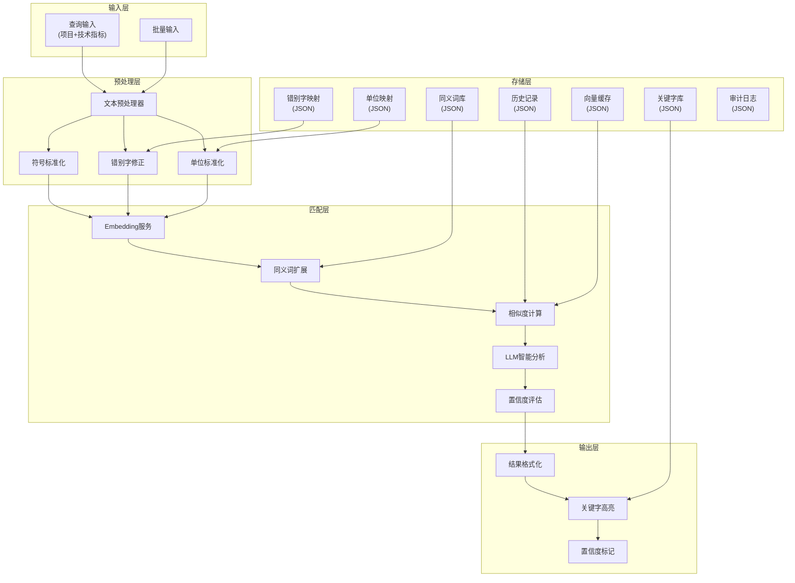

# Design Document: 验收规范智能识别系统

## Overview

本系统采用**Embedding语义匹配 + LLM智能增强 + 文本预处理 + 置信度分级**的混合策略，实现验收规范的智能识别和填写建议。

**技术栈**：
- **前端**：React + TypeScript
- **后端**：C# (.NET 8)
- **数据存储**：JSON文件（无数据库依赖）

**语言环境**：
- **主要语言**：中文
- **可能夹杂**：英文（品牌名、型号、技术术语等）
- **Embedding模型选择**：优先选用中文优化或中英双语模型

**核心架构**：
1. **Embedding匹配**：快速召回相似的历史记录（Top-N候选）
2. **LLM增强判断**：对候选结果进行智能分析，处理复杂语义（如DC/AC互斥、模糊表述理解等）
3. **置信度分级**：结合Embedding相似度和LLM判断，给出最终置信度

这种"Embedding召回 + LLM精排"的架构既保证了效率，又能处理复杂的语义理解场景。

系统使用JSON文件存储所有数据（历史记录、同义词库、关键字库等），不依赖数据库。

## Architecture



## Components and Interfaces

### 后端组件 (C# .NET 8)

### 1. TextPreprocessor (文本预处理器)

负责将输入文本标准化，消除符号差异、错别字等问题。

```csharp
public interface ITextPreprocessor
{
    // 预处理入口
    PreprocessedText Preprocess(string text);
    
    // 符号标准化：中文标点→英文标点，全角→半角
    string NormalizeSymbols(string text);
    
    // 错别字修正
    string CorrectTypos(string text);
    
    // 单位标准化
    NormalizedUnitText NormalizeUnits(string text);
    
    // 空白字符标准化
    string NormalizeWhitespace(string text);
}

public class PreprocessedText
{
    public string Original { get; set; }           // 原始文本
    public string Normalized { get; set; }         // 标准化后文本
    public List<Correction> Corrections { get; set; }  // 修正记录
}

public class Correction
{
    public string Type { get; set; }  // "symbol" | "typo" | "unit" | "whitespace"
    public string Original { get; set; }
    public string Corrected { get; set; }
    public int Position { get; set; }
}

public class NormalizedUnitText
{
    public string Text { get; set; }
    public List<UnitInfo> ExtractedUnits { get; set; }
}

public class UnitInfo
{
    public double Value { get; set; }
    public string Unit { get; set; }
    public string StandardUnit { get; set; }
    public string? Prefix { get; set; }  // DC/AC/单相/三相等
}
```

### 2. EmbeddingService (向量嵌入服务)

负责将文本转换为语义向量，支持多种Embedding模型。

```csharp
public interface IEmbeddingService
{
    // 生成单个文本的向量
    Task<float[]> EmbedAsync(string text);
    
    // 批量生成向量
    Task<List<float[]>> EmbedBatchAsync(List<string> texts);
    
    // 计算余弦相似度
    float CosineSimilarity(float[] vec1, float[] vec2);
    
    // 获取当前模型信息
    ModelInfo GetModelInfo();
    
    // 切换模型
    void SetModel(string modelName);
}

public class ModelInfo
{
    public string Name { get; set; }
    public int Dimension { get; set; }
    public string Provider { get; set; }  // "openai" | "huggingface" | "local"
}
```

### 3. SynonymExpander (同义词扩展器)

负责扩展查询词的同义词，提高匹配召回率。

```csharp
public interface ISynonymExpander
{
    // 扩展查询文本
    ExpandedQuery Expand(string text);
    
    // 获取词的同义词
    List<string> GetSynonyms(string term);
    
    // 添加同义词关系
    void AddSynonym(string term, string synonym, bool bidirectional);
    
    // 加载同义词库
    void LoadSynonymLibrary(string path);
}

public class ExpandedQuery
{
    public string Original { get; set; }
    public string Expanded { get; set; }
    public List<SynonymMatch> SynonymsUsed { get; set; }
}

public class SynonymMatch
{
    public string Original { get; set; }
    public List<string> Synonyms { get; set; }
}
```

### 4. MatchingEngine (匹配引擎)

核心匹配逻辑，整合预处理、向量匹配、LLM分析、置信度评估。

```csharp
public interface IMatchingEngine
{
    // 单条匹配
    Task<MatchResult> MatchAsync(MatchQuery query);
    
    // 批量匹配
    Task<List<MatchResult>> MatchBatchAsync(List<MatchQuery> queries);
    
    // 更新历史记录索引
    Task UpdateIndexAsync(HistoryRecord record);
}

public class MatchQuery
{
    public string Project { get; set; }        // 项目名称
    public string TechnicalSpec { get; set; }  // 技术指标
}

public class MatchResult
{
    public MatchQuery Query { get; set; }
    public List<MatchCandidate> Matches { get; set; }
    public ConfidenceLevel Confidence { get; set; }
    public bool NeedsReview { get; set; }
    public LLMAnalysisResult? LLMAnalysis { get; set; }  // LLM分析结果
}

public class MatchCandidate
{
    public HistoryRecord Record { get; set; }
    public float SimilarityScore { get; set; }
    public string HighlightedActualSpec { get; set; }
    public string HighlightedRemark { get; set; }
}

public enum ConfidenceLevel
{
    High,      // 自动填充
    Medium,    // 建议填充-需复核
    Low,       // 低置信度-需人工处理
    NoMatch    // 无匹配
}
```

### 5. KeywordHighlighter (关键字高亮器)

负责识别和高亮关键字及其同义词。

```csharp
public interface IKeywordHighlighter
{
    // 高亮文本中的关键字
    HighlightedText Highlight(string text);
    
    // 添加关键字
    void AddKeyword(string keyword, List<string> synonyms, HighlightStyle style);
    
    // 加载关键字库
    void LoadKeywordLibrary(string path);
}

public class HighlightedText
{
    public string Html { get; set; }           // 带HTML标签的高亮文本
    public string Plain { get; set; }          // 纯文本
    public List<KeywordHit> Keywords { get; set; } // 命中的关键字
}

public class KeywordHit
{
    public string Keyword { get; set; }
    public string MatchedText { get; set; }
    public int Position { get; set; }
    public bool IsSynonym { get; set; }
}

public class HighlightStyle
{
    public string Color { get; set; }
    public string BackgroundColor { get; set; }
    public string? FontWeight { get; set; }
}
```

### 6. ConfigManager (配置管理器)

统一管理所有可配置参数。

```csharp
public interface IConfigManager
{
    // 获取配置
    T Get<T>(string key);
    
    // 设置配置
    void Set<T>(string key, T value);
    
    // 获取所有配置
    SystemConfig GetAll();
    
    // 重载配置文件
    void Reload();
    
    // 记录配置修改历史
    List<ConfigChange> GetHistory();
}

public class SystemConfig
{
    public EmbeddingConfig Embedding { get; set; }
    public LLMConfig LLM { get; set; }
    public MatchingConfig Matching { get; set; }
    public HighlightingConfig Highlighting { get; set; }
}

public class EmbeddingConfig
{
    public string Model { get; set; }
    public string Provider { get; set; }
    public string? ApiKey { get; set; }
}

public class LLMConfig
{
    public string Model { get; set; }
    public string Provider { get; set; }  // "openai" | "anthropic" | "local"
    public string? ApiKey { get; set; }
    public bool EnableConflictCheck { get; set; }
    public bool EnableScoreAdjustment { get; set; }
}

public class MatchingConfig
{
    public int TopN { get; set; } = 5;
    public float HighConfidenceThreshold { get; set; } = 0.95f;
    public float MediumConfidenceThreshold { get; set; } = 0.85f;
    public float LowConfidenceThreshold { get; set; } = 0.5f;
    public float SimilarCandidateGap { get; set; } = 0.02f;
    public bool UseLLMForFinalDecision { get; set; } = true;
}

public class ConfigChange
{
    public string Key { get; set; }
    public object OldValue { get; set; }
    public object NewValue { get; set; }
    public string ChangedBy { get; set; }
    public DateTime ChangedAt { get; set; }
}
```

### 7. AuditLogger (审计日志器)

记录所有操作用于追溯。

```csharp
public interface IAuditLogger
{
    // 记录查询
    void LogQuery(MatchQuery query, MatchResult result);
    
    // 记录用户确认/修改
    void LogUserAction(UserAction action);
    
    // 记录配置修改
    void LogConfigChange(ConfigChange change);
    
    // 查询日志
    List<AuditLog> QueryLogs(LogFilter filter);
}

public class UserAction
{
    public string Type { get; set; }  // "confirm" | "modify" | "reject"
    public MatchQuery Query { get; set; }
    public MatchCandidate? SelectedResult { get; set; }
    public string? ModifiedValue { get; set; }
    public DateTime Timestamp { get; set; }
}

public class LogFilter
{
    public DateTime? StartTime { get; set; }
    public DateTime? EndTime { get; set; }
    public string? ActionType { get; set; }
}

public class AuditLog
{
    public string Id { get; set; }
    public string Type { get; set; }
    public object Data { get; set; }
    public DateTime Timestamp { get; set; }
}
```

### 8. LLMService (大模型服务)

负责对候选结果进行智能分析和判断，处理复杂语义场景。

```csharp
public interface ILLMService
{
    // 分析候选结果，判断最佳匹配
    Task<LLMAnalysisResult> AnalyzeMatchesAsync(MatchQuery query, List<MatchCandidate> candidates);
    
    // 检查互斥属性冲突（如DC/AC）
    Task<ConflictCheckResult> CheckConflictsAsync(string query, string candidate);
    
    // 获取模型信息
    LLMModelInfo GetModelInfo();
}

public class LLMAnalysisResult
{
    public int BestMatchIndex { get; set; }           // 最佳匹配的索引
    public float Confidence { get; set; }             // LLM判断的置信度 (0-1)
    public string Reasoning { get; set; }             // 判断理由
    public List<ConflictInfo> Conflicts { get; set; } // 发现的冲突
    public List<float> AdjustedScores { get; set; }   // 调整后的分数
}

public class ConflictCheckResult
{
    public bool HasConflict { get; set; }
    public string? ConflictType { get; set; }         // "dc_ac" | "phase" | "other"
    public string? Description { get; set; }
}

public class ConflictInfo
{
    public string Type { get; set; }
    public string QueryValue { get; set; }
    public string CandidateValue { get; set; }
    public string Severity { get; set; }  // "critical" | "warning"
}

public class LLMModelInfo
{
    public string Name { get; set; }
    public string Provider { get; set; }  // "openai" | "anthropic" | "local"
}
```

**LLM分析的核心场景**：

1. **互斥属性检测**：DC24V vs AC24V、单相 vs 三相
2. **模糊表述理解**：判断"电压"是否匹配"供电电压"
3. **复杂规格解析**：理解"3P/380V 50Hz"与"三相380伏50赫兹"的等价性
4. **置信度调整**：根据语义分析调整Embedding的相似度分数

**Prompt模板示例**：

```
你是一个工业验收规范专家，精通中文工业术语和电气设备规格。请分析以下查询和候选匹配结果：

查询：
- 项目：{project}
- 技术指标：{technicalSpec}

候选结果：
{candidates}

请判断：
1. 哪个候选结果最匹配查询？（注意：中英文表述可能不同但含义相同，如"三相"="3P"，"直流"="DC"）
2. 是否存在关键属性冲突？特别注意以下互斥属性：
   - DC（直流）vs AC（交流）
   - 单相 vs 三相
   - 常开 vs 常闭
   - NPN vs PNP
3. 你的置信度是多少（0-1）？

请以JSON格式返回结果：
{
  "bestMatchIndex": 0,
  "confidence": 0.95,
  "reasoning": "判断理由",
  "conflicts": []
}
```

### 前端组件 (React + TypeScript)

### 9. API接口定义

后端提供RESTful API供前端调用：

```csharp
// API Controllers

[ApiController]
[Route("api/[controller]")]
public class MatchController : ControllerBase
{
    // POST /api/match - 单条匹配
    [HttpPost]
    public async Task<ActionResult<MatchResult>> Match([FromBody] MatchQuery query);
    
    // POST /api/match/batch - 批量匹配
    [HttpPost("batch")]
    public async Task<ActionResult<List<MatchResult>>> MatchBatch([FromBody] List<MatchQuery> queries);
    
    // POST /api/match/confirm - 确认匹配结果
    [HttpPost("confirm")]
    public async Task<ActionResult> ConfirmMatch([FromBody] UserAction action);
}

[ApiController]
[Route("api/[controller]")]
public class HistoryController : ControllerBase
{
    // GET /api/history - 获取历史记录列表
    [HttpGet]
    public async Task<ActionResult<List<HistoryRecord>>> GetHistory([FromQuery] string? project, [FromQuery] string? keyword);
    
    // POST /api/history - 添加历史记录
    [HttpPost]
    public async Task<ActionResult<HistoryRecord>> AddHistory([FromBody] HistoryRecord record);
    
    // PUT /api/history/{id} - 更新历史记录
    [HttpPut("{id}")]
    public async Task<ActionResult> UpdateHistory(string id, [FromBody] HistoryRecord record);
}

[ApiController]
[Route("api/[controller]")]
public class ConfigController : ControllerBase
{
    // GET /api/config - 获取配置
    [HttpGet]
    public async Task<ActionResult<SystemConfig>> GetConfig();
    
    // PUT /api/config - 更新配置
    [HttpPut]
    public async Task<ActionResult> UpdateConfig([FromBody] SystemConfig config);
    
    // GET /api/config/synonyms - 获取同义词库
    [HttpGet("synonyms")]
    public async Task<ActionResult<SynonymLibrary>> GetSynonyms();
    
    // GET /api/config/keywords - 获取关键字库
    [HttpGet("keywords")]
    public async Task<ActionResult<KeywordLibrary>> GetKeywords();
}

[ApiController]
[Route("api/[controller]")]
public class AuditController : ControllerBase
{
    // GET /api/audit - 查询审计日志
    [HttpGet]
    public async Task<ActionResult<List<AuditLog>>> GetLogs([FromQuery] LogFilter filter);
}
```

### 10. React前端组件

```typescript
// 主要页面组件

// 1. 匹配查询页面
interface MatchPageProps {}
const MatchPage: React.FC<MatchPageProps>;

// 2. 批量处理页面
interface BatchPageProps {}
const BatchPage: React.FC<BatchPageProps>;

// 3. 历史记录管理页面
interface HistoryPageProps {}
const HistoryPage: React.FC<HistoryPageProps>;

// 4. 配置管理页面
interface ConfigPageProps {}
const ConfigPage: React.FC<ConfigPageProps>;

// 5. 审计日志页面
interface AuditPageProps {}
const AuditPage: React.FC<AuditPageProps>;

// 核心UI组件

// 匹配结果卡片 - 显示单个匹配结果，包含高亮和置信度
interface MatchResultCardProps {
  result: MatchCandidate;
  confidence: ConfidenceLevel;
  onConfirm: () => void;
  onReject: () => void;
}
const MatchResultCard: React.FC<MatchResultCardProps>;

// 高亮文本组件 - 渲染带关键字高亮的文本
interface HighlightedTextProps {
  html: string;
}
const HighlightedText: React.FC<HighlightedTextProps>;

// 置信度徽章 - 显示置信度等级
interface ConfidenceBadgeProps {
  level: ConfidenceLevel;
}
const ConfidenceBadge: React.FC<ConfidenceBadgeProps>;

// 查询输入表单
interface QueryFormProps {
  onSubmit: (query: MatchQuery) => void;
  loading: boolean;
}
const QueryForm: React.FC<QueryFormProps>;

// 批量上传组件
interface BatchUploadProps {
  onUpload: (queries: MatchQuery[]) => void;
}
const BatchUpload: React.FC<BatchUploadProps>;
```


## Data Models

### 历史记录 (history_records.json)

```csharp
public class HistoryRecord
{
    public string Id { get; set; }
    public string Project { get; set; }           // 项目名称
    public string TechnicalSpec { get; set; }     // 技术指标
    public string ActualSpec { get; set; }        // 实际规格/实际设计
    public string Remark { get; set; }            // 备注
    public DateTime CreatedAt { get; set; }
    public DateTime UpdatedAt { get; set; }
    public float[]? Embedding { get; set; }       // 缓存的向量（可选）
}
```

示例数据结构：
```json
{
  "records": [
    {
      "id": "rec_001",
      "project": "额定功率",
      "technicalSpec": "",
      "actualSpec": "1KW",
      "remark": "",
      "createdAt": "2024-01-15T10:00:00Z"
    },
    {
      "id": "rec_002",
      "project": "电压(V/Hz)",
      "technicalSpec": "3P/380V 50Hz",
      "actualSpec": "3P/380V 50Hz",
      "remark": "",
      "createdAt": "2024-01-15T10:00:00Z"
    },
    {
      "id": "rec_003",
      "project": "PLC",
      "technicalSpec": "三菱FX-5U、Q或R系列，或程序不可加密，带点位注释",
      "actualSpec": "1: FX5U系列系列\n2: 交换机转换器\n3: OK",
      "remark": "",
      "createdAt": "2024-01-15T10:00:00Z"
    }
  ]
}
```

### 同义词库 (synonyms.json)

```csharp
public class SynonymLibrary
{
    public string Version { get; set; }
    public List<SynonymGroup> Groups { get; set; }
}

public class SynonymGroup
{
    public string Id { get; set; }
    public string Category { get; set; }  // "electrical" | "plc" | "sensor" | "general"
    public List<string> Terms { get; set; }   // 互为同义词的词组
    public bool Bidirectional { get; set; }
}
```

示例数据：
```json
{
  "version": "1.0",
  "groups": [
    // 电气单位类
    {
      "id": "syn_001",
      "category": "electrical",
      "terms": ["电压", "供电电压", "工作电压", "额定电压", "Voltage"],
      "bidirectional": true
    },
    {
      "id": "syn_002",
      "category": "electrical",
      "terms": ["V", "伏", "伏特", "Volt"],
      "bidirectional": true
    },
    {
      "id": "syn_003",
      "category": "electrical",
      "terms": ["3P", "三相", "3相", "three phase", "Three Phase"],
      "bidirectional": true
    },
    {
      "id": "syn_004",
      "category": "electrical",
      "terms": ["1P", "单相", "1相", "single phase", "Single Phase"],
      "bidirectional": true
    },
    {
      "id": "syn_005",
      "category": "electrical",
      "terms": ["Hz", "赫兹", "HZ", "Hertz"],
      "bidirectional": true
    },
    {
      "id": "syn_006",
      "category": "electrical",
      "terms": ["KW", "千瓦", "kW", "kilowatt"],
      "bidirectional": true
    },
    {
      "id": "syn_007",
      "category": "electrical",
      "terms": ["A", "安", "安培", "Amp", "Ampere"],
      "bidirectional": true
    },
    {
      "id": "syn_008",
      "category": "electrical",
      "terms": ["DC", "直流", "D.C."],
      "bidirectional": true
    },
    {
      "id": "syn_009",
      "category": "electrical",
      "terms": ["AC", "交流", "A.C."],
      "bidirectional": true
    },
    
    // PLC类
    {
      "id": "syn_010",
      "category": "plc",
      "terms": ["PLC", "可编程逻辑控制器", "可编程控制器", "Programmable Logic Controller"],
      "bidirectional": true
    },
    {
      "id": "syn_011",
      "category": "plc",
      "terms": ["HMI", "人机界面", "触摸屏", "Human Machine Interface"],
      "bidirectional": true
    },
    {
      "id": "syn_012",
      "category": "plc",
      "terms": ["I/O", "输入输出", "IO", "Input/Output"],
      "bidirectional": true
    },
    
    // 传感器类
    {
      "id": "syn_020",
      "category": "sensor",
      "terms": ["NPN", "NPN型", "NPN输出"],
      "bidirectional": true
    },
    {
      "id": "syn_021",
      "category": "sensor",
      "terms": ["PNP", "PNP型", "PNP输出"],
      "bidirectional": true
    },
    {
      "id": "syn_022",
      "category": "sensor",
      "terms": ["常开", "NO", "Normally Open"],
      "bidirectional": true
    },
    {
      "id": "syn_023",
      "category": "sensor",
      "terms": ["常闭", "NC", "Normally Closed"],
      "bidirectional": true
    },
    {
      "id": "syn_024",
      "category": "sensor",
      "terms": ["接近开关", "接近传感器", "Proximity Sensor", "Proximity Switch"],
      "bidirectional": true
    },
    
    // 通讯类
    {
      "id": "syn_030",
      "category": "communication",
      "terms": ["以太网", "Ethernet", "网口", "RJ45"],
      "bidirectional": true
    },
    {
      "id": "syn_031",
      "category": "communication",
      "terms": ["串口", "RS232", "RS-232", "COM口"],
      "bidirectional": true
    },
    {
      "id": "syn_032",
      "category": "communication",
      "terms": ["RS485", "RS-485", "485通讯"],
      "bidirectional": true
    },
    
    // 品牌类
    {
      "id": "syn_040",
      "category": "brand",
      "terms": ["三菱", "Mitsubishi", "MITSUBISHI"],
      "bidirectional": true
    },
    {
      "id": "syn_041",
      "category": "brand",
      "terms": ["西门子", "Siemens", "SIEMENS"],
      "bidirectional": true
    },
    {
      "id": "syn_042",
      "category": "brand",
      "terms": ["欧姆龙", "Omron", "OMRON"],
      "bidirectional": true
    },
    {
      "id": "syn_043",
      "category": "brand",
      "terms": ["施耐德", "Schneider", "SCHNEIDER"],
      "bidirectional": true
    },
    {
      "id": "syn_044",
      "category": "brand",
      "terms": ["ABB", "abb"],
      "bidirectional": true
    }
  ]
}
```

### 关键字库 (keywords.json)

```csharp
public class KeywordLibrary
{
    public string Version { get; set; }
    public List<KeywordEntry> Keywords { get; set; }
}

public class KeywordEntry
{
    public string Id { get; set; }
    public string Keyword { get; set; }
    public List<string> Synonyms { get; set; }
    public string Category { get; set; }
    public HighlightStyle Style { get; set; }
}
```

示例数据：
```json
{
  "version": "1.0",
  "keywords": [
    {
      "id": "kw_001",
      "keyword": "三菱",
      "synonyms": ["Mitsubishi", "MITSUBISHI"],
      "category": "brand",
      "style": {"color": "#d32f2f", "backgroundColor": "#ffebee"}
    },
    {
      "id": "kw_002",
      "keyword": "西门子",
      "synonyms": ["Siemens", "SIEMENS"],
      "category": "brand",
      "style": {"color": "#1976d2", "backgroundColor": "#e3f2fd"}
    },
    {
      "id": "kw_003",
      "keyword": "PLC",
      "synonyms": ["可编程逻辑控制器"],
      "category": "device",
      "style": {"color": "#388e3c", "backgroundColor": "#e8f5e9"}
    },
    {
      "id": "kw_004",
      "keyword": "FX5U",
      "synonyms": ["FX-5U"],
      "category": "model",
      "style": {"color": "#7b1fa2", "backgroundColor": "#f3e5f5"}
    }
  ]
}
```

### 错别字映射表 (typo_corrections.json)

```json
{
  "version": "1.0",
  "corrections": {
    "额定攻率": "额定功率",
    "电亚": "电压",
    "赫磁": "赫兹",
    "传敢器": "传感器",
    "可编成": "可编程",
    "接触气": "接触器"
  }
}
```

### 单位映射表 (unit_mappings.json)

**注意：单位映射表为系统内置，用户无需维护。** 物理单位的转换关系是固定的，系统预置了常见工业单位。

```json
{
  "version": "1.0",
  "description": "系统内置单位映射表，无需用户维护",
  "units": {
    "voltage": {
      "standard": "V",
      "aliases": ["伏", "伏特", "v", "Volt", "volt"],
      "prefixes": {
        "K": 1000,
        "k": 1000,
        "M": 1000000,
        "m": 0.001
      }
    },
    "current": {
      "standard": "A",
      "aliases": ["安", "安培", "a", "Amp", "amp"],
      "prefixes": {
        "m": 0.001,
        "K": 1000,
        "μ": 0.000001
      }
    },
    "power": {
      "standard": "W",
      "aliases": ["瓦", "瓦特", "w", "Watt", "watt"],
      "prefixes": {
        "K": 1000,
        "k": 1000,
        "M": 1000000,
        "m": 0.001
      }
    },
    "frequency": {
      "standard": "Hz",
      "aliases": ["赫兹", "hz", "HZ", "Hertz", "hertz"],
      "prefixes": {
        "K": 1000,
        "M": 1000000,
        "G": 1000000000
      }
    },
    "pressure": {
      "standard": "bar",
      "aliases": ["巴", "Bar", "BAR"],
      "prefixes": {
        "m": 0.001
      },
      "conversions": {
        "MPa": 10,
        "kPa": 0.01,
        "psi": 0.0689476
      }
    },
    "temperature": {
      "standard": "℃",
      "aliases": ["度", "摄氏度", "°C", "C"]
    },
    "length": {
      "standard": "mm",
      "aliases": ["毫米"],
      "conversions": {
        "m": 1000,
        "cm": 10,
        "μm": 0.001
      }
    },
    "resistance": {
      "standard": "Ω",
      "aliases": ["欧", "欧姆", "ohm", "Ohm"],
      "prefixes": {
        "K": 1000,
        "M": 1000000
      }
    }
  },
  "electricalPrefixes": {
    "DC": ["直流", "dc", "D.C.", "d.c."],
    "AC": ["交流", "ac", "A.C.", "a.c."],
    "1P": ["单相", "1相", "single phase"],
    "3P": ["三相", "3相", "three phase"]
  }
}
```

**系统内置，用户无需维护的原因**：
1. 物理单位转换关系是固定的（1KW永远等于1000W）
2. 电气前缀（DC/AC）的含义是标准化的
3. 错误的单位映射会导致严重的匹配错误
4. 如需扩展，由系统管理员通过版本更新添加

### 系统配置 (config.json)

```json
{
  "version": "1.0",
  "embedding": {
    "model": "text-embedding-3-small",
    "provider": "openai",
    "dimension": 1536
  },
  "llm": {
    "model": "gpt-4o-mini",
    "provider": "openai",
    "enableConflictCheck": true,
    "enableScoreAdjustment": true
  },
  "matching": {
    "topN": 5,
    "highConfidenceThreshold": 0.95,
    "mediumConfidenceThreshold": 0.85,
    "lowConfidenceThreshold": 0.5,
    "similarCandidateGap": 0.02,
    "useLLMForFinalDecision": true
  },
  "highlighting": {
    "defaultStyle": {
      "color": "#000000",
      "backgroundColor": "#ffff00",
      "fontWeight": "bold"
    }
  },
  "paths": {
    "historyRecords": "./data/history_records.json",
    "vectorCache": "./data/vector_cache.json",
    "synonyms": "./data/synonyms.json",
    "keywords": "./data/keywords.json",
    "typoCorrections": "./data/typo_corrections.json",
    "auditLog": "./data/audit_log.json"
  }
}
```

**配置数据分类**：

| 数据类型 | 文件 | 用户可维护 | 说明 |
|---------|------|-----------|------|
| 历史记录 | history_records.json | ✅ 是 | 用户可添加、编辑、删除 |
| 同义词库 | synonyms.json | ✅ 是 | 用户可添加领域专业术语 |
| 关键字库 | keywords.json | ✅ 是 | 用户可定义需要高亮的关键字 |
| 错别字映射 | typo_corrections.json | ✅ 是 | 用户可添加常见错别字 |
| 单位映射 | unit_mappings.json | ❌ 否 | 系统内置，物理单位转换固定 |
| 系统配置 | config.json | ✅ 是 | 阈值、模型等可调整 |


## Correctness Properties

*A property is a characteristic or behavior that should hold true across all valid executions of a system—essentially, a formal statement about what the system should do. Properties serve as the bridge between human-readable specifications and machine-verifiable correctness guarantees.*

### Property 1: 文本预处理保持语义完整性

*For any* 输入文本，经过预处理后：
- 不包含中文标点符号（全部转换为英文标点）
- 不包含全角字符（全部转换为半角）
- 不包含连续空白字符（标准化为单个空格）
- 错别字映射表中的错别字被正确替换

**Validates: Requirements 1.1, 1.2, 1.3, 1.4**

### Property 2: 向量生成一致性

*For any* 非空文本输入，Embedding服务生成的向量：
- 维度固定（与配置的模型维度一致）
- 向量元素为有效浮点数
- 相同文本多次生成的向量相同

**Validates: Requirements 2.1**

### Property 3: 余弦相似度范围正确性

*For any* 两个向量的余弦相似度计算结果，值必须在 [-1, 1] 范围内

**Validates: Requirements 2.2**

### Property 4: Top-N结果排序正确性

*For any* 匹配查询，返回的结果：
- 数量不超过配置的N值
- 按相似度降序排列（第i个结果的相似度 ≥ 第i+1个结果的相似度）

**Validates: Requirements 2.3**

### Property 5: 增量索引一致性

*For any* 新添加的历史记录，添加后立即查询该记录的精确内容，应能在结果中找到该记录

**Validates: Requirements 2.5, 5.3**

### Property 6: 置信度分级正确性

*For any* 匹配结果的相似度分数 s 和配置的阈值（高H、中M、低L）：
- s ≥ H → 置信度等级为 "high"
- M ≤ s < H → 置信度等级为 "medium"
- L ≤ s < M → 置信度等级为 "low"
- s < L → 置信度等级为 "no_match"

**Validates: Requirements 3.1, 3.2, 3.3**

### Property 7: 关键字高亮完整性

*For any* 包含关键字库中关键字（或其同义词）的文本，高亮处理后：
- 所有匹配的关键字都被标记
- 所有匹配的同义词都被标记
- 高亮结果的keywords数组包含所有命中项

**Validates: Requirements 4.1, 4.2**

### Property 8: 匹配结果完整性

*For any* 成功的匹配结果，返回的数据必须包含：
- actualSpec（实际规格/实际设计）字段
- remark（备注）字段
- 置信度等级标识
- 匹配来源记录ID

**Validates: Requirements 8.1, 8.2, 8.3, 8.5**

### Property 9: 批量处理结果一致性

*For any* 包含N条记录的批量查询，返回的结果数量必须等于N

**Validates: Requirements 9.2**

### Property 10: 单位标准化正确性

*For any* 包含单位的文本（如"380伏"、"1千瓦"），标准化后：
- 单位别名被转换为标准单位（伏→V，千瓦→KW）
- 数值保持不变
- 电气前缀（DC/AC）被保留为独立属性

**Validates: Requirements 11.1, 11.5**

## Error Handling

### 1. Embedding服务错误

| 错误类型 | 处理方式 |
|---------|---------|
| API调用失败 | 重试3次，间隔指数退避，最终失败返回错误 |
| 模型不可用 | 切换到备用模型或返回错误提示 |
| 向量维度不匹配 | 记录错误日志，拒绝该向量 |

### 2. 数据文件错误

| 错误类型 | 处理方式 |
|---------|---------|
| 文件不存在 | 创建默认空文件或使用内置默认值 |
| JSON解析失败 | 记录错误，使用上次有效配置 |
| 文件写入失败 | 重试，失败后记录错误并通知 |

### 3. 匹配错误

| 错误类型 | 处理方式 |
|---------|---------|
| 空查询 | 返回参数错误提示 |
| 历史记录为空 | 返回"无匹配-需人工处理" |
| 相似度计算异常 | 跳过该记录，记录日志 |

## Testing Strategy

### 测试策略

### 后端测试 (C# xUnit + FsCheck)

针对各组件的核心功能：

1. **TextPreprocessor测试**
   - 符号转换正确性
   - 错别字修正正确性
   - 单位标准化正确性

2. **EmbeddingService测试**
   - 向量生成正确性
   - 相似度计算正确性

3. **KeywordHighlighter测试**
   - 关键字识别正确性
   - 同义词匹配正确性

4. **MatchingEngine测试**
   - 置信度分级正确性
   - Top-N排序正确性

### 属性测试 (Property-Based Testing)

使用 FsCheck 库进行属性测试，每个属性测试运行至少100次迭代。

测试标签格式：`Feature: acceptance-spec-recognition, Property N: [property_text]`

1. **Property 1**: 生成随机中文文本，验证预处理后符号标准化
2. **Property 2**: 生成随机文本，验证向量维度一致
3. **Property 3**: 生成随机向量对，验证相似度范围
4. **Property 4**: 生成随机查询，验证结果排序
5. **Property 5**: 生成随机记录，验证增量索引
6. **Property 6**: 生成随机分数，验证置信度分级
7. **Property 7**: 生成包含关键字的随机文本，验证高亮完整性
8. **Property 8**: 执行随机匹配，验证结果字段完整性
9. **Property 9**: 生成随机批量查询，验证结果数量
10. **Property 10**: 生成包含单位的随机文本，验证标准化

### 前端测试 (React Testing Library + Jest)

1. **组件渲染测试**
   - MatchResultCard正确渲染
   - HighlightedText正确显示高亮
   - ConfidenceBadge显示正确等级

2. **交互测试**
   - 表单提交
   - 确认/拒绝操作
   - 批量上传

### 集成测试

1. 端到端匹配流程测试
2. 批量处理测试
3. 配置热加载测试


## 增强设计

### 1. 向量缓存与性能优化

为了提高匹配效率，需要对向量进行缓存和索引优化：

```csharp
public interface IVectorIndexService
{
    // 构建向量索引（启动时加载）
    Task BuildIndexAsync();
    
    // 搜索最相似的向量（使用近似最近邻算法）
    Task<List<(string RecordId, float Score)>> SearchAsync(float[] queryVector, int topK);
    
    // 添加向量到索引
    Task AddToIndexAsync(string recordId, float[] vector);
    
    // 从索引中删除向量
    Task RemoveFromIndexAsync(string recordId);
    
    // 获取索引统计信息
    IndexStats GetStats();
}

public class IndexStats
{
    public int TotalVectors { get; set; }
    public DateTime LastUpdated { get; set; }
    public long MemoryUsageBytes { get; set; }
}
```

**向量缓存策略**：
- 启动时加载所有历史记录的向量到内存
- 使用HNSW（Hierarchical Navigable Small World）算法加速相似度搜索
- 新增记录时增量更新索引
- 定期持久化索引到文件

### 2. LLM调用优化与降级策略

```csharp
public interface ILLMServiceWithFallback : ILLMService
{
    // 带超时和重试的分析
    Task<LLMAnalysisResult> AnalyzeWithTimeoutAsync(
        MatchQuery query, 
        List<MatchCandidate> candidates,
        TimeSpan timeout,
        int maxRetries = 3);
    
    // 降级到纯Embedding模式
    MatchResult FallbackToEmbeddingOnly(MatchQuery query, List<MatchCandidate> candidates);
}

public class LLMConfig
{
    // ... 原有配置 ...
    
    // 新增配置
    public int TimeoutSeconds { get; set; } = 30;
    public int MaxRetries { get; set; } = 3;
    public bool EnableFallback { get; set; } = true;  // LLM失败时降级到纯Embedding
    public float FallbackConfidencePenalty { get; set; } = 0.1f;  // 降级时置信度惩罚
}
```

**降级策略**：
- LLM调用超时或失败时，自动降级到纯Embedding模式
- 降级时对置信度进行惩罚（降低0.1），提示用户需要更谨慎复核
- 记录降级事件到审计日志

### 3. 匹配结果解释性增强

用户需要理解为什么系统给出这个匹配结果：

```csharp
public class MatchExplanation
{
    public float EmbeddingSimilarity { get; set; }      // Embedding相似度
    public float? LLMAdjustedScore { get; set; }       // LLM调整后分数
    public string? LLMReasoning { get; set; }          // LLM判断理由
    public List<string> MatchedKeywords { get; set; }  // 匹配的关键字
    public List<string> MatchedSynonyms { get; set; }  // 匹配的同义词
    public List<PreprocessingStep> PreprocessingSteps { get; set; }  // 预处理步骤
}

public class PreprocessingStep
{
    public string Type { get; set; }      // "symbol" | "typo" | "unit"
    public string Before { get; set; }
    public string After { get; set; }
}

public class MatchCandidate
{
    // ... 原有字段 ...
    public MatchExplanation Explanation { get; set; }  // 新增：匹配解释
}
```

### 4. 批量处理进度与中断

```csharp
public interface IBatchProcessor
{
    // 开始批量处理（返回任务ID）
    Task<string> StartBatchAsync(List<MatchQuery> queries);
    
    // 获取批量处理进度
    BatchProgress GetProgress(string taskId);
    
    // 取消批量处理
    Task CancelAsync(string taskId);
    
    // 获取批量处理结果
    Task<BatchResult> GetResultAsync(string taskId);
}

public class BatchProgress
{
    public string TaskId { get; set; }
    public int Total { get; set; }
    public int Completed { get; set; }
    public int Failed { get; set; }
    public string Status { get; set; }  // "running" | "completed" | "cancelled" | "failed"
    public DateTime StartedAt { get; set; }
    public DateTime? CompletedAt { get; set; }
}

public class BatchResult
{
    public string TaskId { get; set; }
    public List<MatchResult> Results { get; set; }
    public BatchSummary Summary { get; set; }
}

public class BatchSummary
{
    public int TotalCount { get; set; }
    public int HighConfidenceCount { get; set; }
    public int MediumConfidenceCount { get; set; }
    public int LowConfidenceCount { get; set; }
    public int NoMatchCount { get; set; }
    public int NeedsReviewCount { get; set; }
}
```

### 5. 用户反馈学习机制

用户的确认/修改操作可以用于优化系统：

```csharp
public interface IFeedbackLearner
{
    // 记录用户反馈
    Task RecordFeedbackAsync(UserFeedback feedback);
    
    // 分析反馈数据，生成优化建议
    Task<OptimizationSuggestions> AnalyzeFeedbackAsync();
    
    // 获取反馈统计
    FeedbackStats GetStats();
}

public class UserFeedback
{
    public string QueryId { get; set; }
    public MatchQuery Query { get; set; }
    public MatchCandidate? SelectedCandidate { get; set; }
    public string? UserModifiedActualSpec { get; set; }
    public string? UserModifiedRemark { get; set; }
    public string FeedbackType { get; set; }  // "confirm" | "modify" | "reject"
    public DateTime Timestamp { get; set; }
}

public class OptimizationSuggestions
{
    public List<SynonymSuggestion> NewSynonyms { get; set; }      // 建议添加的同义词
    public List<TypoCorrectionSuggestion> NewTypos { get; set; }  // 建议添加的错别字
    public List<ThresholdAdjustment> ThresholdAdjustments { get; set; }  // 阈值调整建议
}

public class SynonymSuggestion
{
    public string Term1 { get; set; }
    public string Term2 { get; set; }
    public int OccurrenceCount { get; set; }  // 用户确认次数
    public float Confidence { get; set; }
}

public class FeedbackStats
{
    public int TotalFeedbacks { get; set; }
    public int ConfirmCount { get; set; }
    public int ModifyCount { get; set; }
    public int RejectCount { get; set; }
    public float AccuracyRate { get; set; }  // 确认率
}
```

### 6. 中文优化Embedding模型支持

考虑到项目主要针对中文，可能夹杂英文（品牌名、型号等）：

```csharp
public class EmbeddingConfig
{
    public string Model { get; set; }
    public string Provider { get; set; }
    public string? ApiKey { get; set; }
    public int Dimension { get; set; }
    
    // 语言配置
    public string PrimaryLanguage { get; set; } = "zh";  // 主要语言：中文
    public bool MixedLanguageSupport { get; set; } = true;  // 支持中英混合
    
    // 备用模型配置
    public string? FallbackModel { get; set; }
    public string? FallbackProvider { get; set; }
}
```

**推荐的Embedding模型（按优先级）**：

| 模型 | 提供商 | 特点 | 推荐场景 |
|-----|-------|------|---------|
| `text-embedding-3-small` | OpenAI | 中英双语支持好，性价比高 | **首选**，适合大多数场景 |
| `text-embedding-3-large` | OpenAI | 精度更高，成本更高 | 对精度要求极高时使用 |
| `bge-large-zh-v1.5` | BAAI | 中文优化，可本地部署 | 需要本地部署或离线使用 |
| `m3e-large` | Moka | 中文优化，开源 | 本地部署备选 |
| `multilingual-e5-large` | Microsoft | 多语言支持 | 多语言混合场景 |

**中文特殊处理**：
1. 中英文混合文本不做分词，直接整体Embedding
2. 品牌名、型号等英文保持原样（如"三菱FX5U"、"西门子S7-1500"）
3. 同义词库包含中英对照（如"PLC"↔"可编程逻辑控制器"）

### 7. 安全与权限控制

```csharp
public interface IAuthorizationService
{
    // 验证用户权限
    bool HasPermission(string userId, string action);
    
    // 获取用户角色
    UserRole GetUserRole(string userId);
}

public enum UserRole
{
    Viewer,      // 只能查看和使用匹配功能
    Editor,      // 可以确认/修改匹配结果
    Admin        // 可以管理配置、历史记录等
}

public class PermissionConfig
{
    public Dictionary<string, List<UserRole>> ActionPermissions { get; set; } = new()
    {
        ["match"] = new() { UserRole.Viewer, UserRole.Editor, UserRole.Admin },
        ["confirm"] = new() { UserRole.Editor, UserRole.Admin },
        ["modify_history"] = new() { UserRole.Admin },
        ["modify_config"] = new() { UserRole.Admin },
        ["view_audit"] = new() { UserRole.Admin }
    };
}
```

### 8. 健康检查与监控

```csharp
public interface IHealthCheckService
{
    // 检查所有服务健康状态
    Task<HealthStatus> CheckAllAsync();
    
    // 检查单个服务
    Task<ServiceHealth> CheckServiceAsync(string serviceName);
}

public class HealthStatus
{
    public bool IsHealthy { get; set; }
    public Dictionary<string, ServiceHealth> Services { get; set; }
    public DateTime CheckedAt { get; set; }
}

public class ServiceHealth
{
    public string Name { get; set; }
    public bool IsHealthy { get; set; }
    public string? ErrorMessage { get; set; }
    public long ResponseTimeMs { get; set; }
}
```

**监控指标**：
- Embedding API响应时间
- LLM API响应时间
- 匹配请求QPS
- 置信度分布统计
- 错误率

### 9. 前端增强组件

```typescript
// 匹配解释组件 - 显示为什么匹配到这个结果
interface MatchExplanationProps {
  explanation: MatchExplanation;
}
const MatchExplanationPanel: React.FC<MatchExplanationProps>;

// 批量处理进度组件
interface BatchProgressProps {
  taskId: string;
  onComplete: (result: BatchResult) => void;
  onCancel: () => void;
}
const BatchProgressBar: React.FC<BatchProgressProps>;

// 反馈收集组件
interface FeedbackFormProps {
  query: MatchQuery;
  selectedResult: MatchCandidate;
  onSubmit: (feedback: UserFeedback) => void;
}
const FeedbackForm: React.FC<FeedbackFormProps>;

// 配置编辑器组件（支持JSON编辑）
interface ConfigEditorProps {
  configType: 'synonyms' | 'keywords' | 'typos' | 'units';
  onSave: (config: any) => void;
}
const ConfigEditor: React.FC<ConfigEditorProps>;

// 统计仪表盘组件
interface DashboardProps {}
const StatsDashboard: React.FC<DashboardProps>;
```

### 10. 更丰富的示例数据

扩展历史记录示例数据，覆盖更多工业场景：

```json
{
  "records": [
    // 电气参数类
    {"id": "rec_001", "project": "额定功率", "technicalSpec": "", "actualSpec": "1KW", "remark": ""},
    {"id": "rec_002", "project": "电压(V/Hz)", "technicalSpec": "3P/380V 50Hz", "actualSpec": "3P/380V 50Hz", "remark": ""},
    {"id": "rec_003", "project": "电流", "technicalSpec": "", "actualSpec": "2.8A", "remark": ""},
    {"id": "rec_004", "project": "控制电压", "technicalSpec": "DC24V", "actualSpec": "DC24V", "remark": ""},
    {"id": "rec_005", "project": "控制电压", "technicalSpec": "AC220V", "actualSpec": "AC220V", "remark": ""},
    
    // PLC类
    {"id": "rec_010", "project": "PLC", "technicalSpec": "三菱FX-5U、Q或R系列", "actualSpec": "FX5U系列", "remark": "程序不可加密，带点位注释"},
    {"id": "rec_011", "project": "PLC", "technicalSpec": "西门子S7-1200或S7-1500", "actualSpec": "S7-1500", "remark": ""},
    {"id": "rec_012", "project": "PLC通讯", "technicalSpec": "以太网接口", "actualSpec": "预留以太网接口", "remark": "用于供买方服务器连接"},
    
    // 传感器类
    {"id": "rec_020", "project": "温度传感器", "technicalSpec": "PT100", "actualSpec": "PT100", "remark": "精度±0.5℃"},
    {"id": "rec_021", "project": "压力传感器", "technicalSpec": "0-10bar", "actualSpec": "0-10bar", "remark": "4-20mA输出"},
    {"id": "rec_022", "project": "接近开关", "technicalSpec": "NPN常开", "actualSpec": "NPN常开", "remark": "检测距离5mm"},
    
    // 电控箱类
    {"id": "rec_030", "project": "电控箱设计", "technicalSpec": "独立电控柜", "actualSpec": "内嵌式电柜", "remark": ""},
    {"id": "rec_031", "project": "电控箱进线", "technicalSpec": "", "actualSpec": "二侧下方或侧方", "remark": ""},
    {"id": "rec_032", "project": "电控箱内环境温度要求", "technicalSpec": "", "actualSpec": "不适用", "remark": ""},
    {"id": "rec_033", "project": "电控箱送风", "technicalSpec": "", "actualSpec": "", "remark": ""},
    
    // 安全类
    {"id": "rec_040", "project": "急停按钮", "technicalSpec": "红色蘑菇头", "actualSpec": "红色蘑菇头急停按钮", "remark": "自锁式"},
    {"id": "rec_041", "project": "安全门锁", "technicalSpec": "电磁锁", "actualSpec": "电磁安全门锁", "remark": "带门状态检测"},
    
    // 通讯类
    {"id": "rec_050", "project": "通讯协议", "technicalSpec": "Modbus TCP", "actualSpec": "Modbus TCP", "remark": ""},
    {"id": "rec_051", "project": "通讯协议", "technicalSpec": "OPC UA", "actualSpec": "OPC UA", "remark": ""},
    {"id": "rec_052", "project": "数据采集", "technicalSpec": "按数据采集系统模板配置", "actualSpec": "已配置", "remark": "交互数据独立DB块"}
  ]
}
```
