# 验收规格管理系统 — 核心架构图

> 以下图表使用 [Mermaid](https://mermaid.js.org/) 语法，可直接在支持 Mermaid 的编辑器中渲染。
>
> **文档版本**: v2.3 | **日期**: 2026-04-09 | **状态**: 已按当前代码核对，聚焦架构主链路并补充失败回退与后续流转

---

## 一、当前真实分层

### 1.1 代码分层与实际依赖

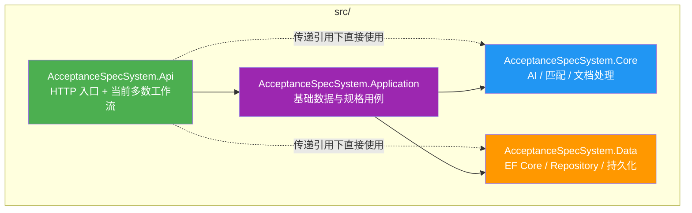

**当前结论**：
- `Api` 项目仍承载上传、导入、智能填充、严格复用、批量回复等多数工作流。
- `Application` 当前主要是基础数据与规格查询，不是完整业务编排层。
- `Core` 负责文档解析、匹配计算、Embedding、LLM 协作。
- 文档里如果把“所有业务都已经下沉到 Application”画出来，会和当前代码不一致。

### 1.2 核心职责划分

| 层次 | 当前职责 |
|------|---------|
| `AcceptanceSpecSystem.Api` | 控制器入口、权限中间件、以及多数工作流应用服务 |
| `AcceptanceSpecSystem.Application` | 客户、制程、机型、规格等基础数据用例 |
| `AcceptanceSpecSystem.Core` | Word/Excel 解析写回、匹配引擎、Embedding、LLM 能力 |
| `AcceptanceSpecSystem.Data` | `DbContext`、仓储、迁移、持久化实现 |

### 1.3 核心业务闭环图（增强版）

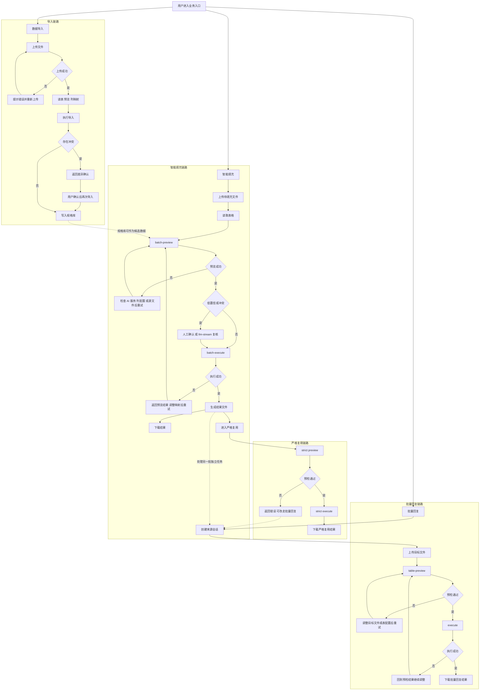

**增强说明**：
- 失败分支都回到了真实可继续操作的节点，不画“自动神奇恢复”。
- 智能填充成功后的真实后续是：下载结果、进入严格复用、或转入批量回复模块处理另一批文件。
- 从智能填充到批量回复这里画的是“业务流转”，不是同一个 `taskId` 的直接串行执行。

---

## 二、上传链路架构

### 2.1 上传与导入组件关系

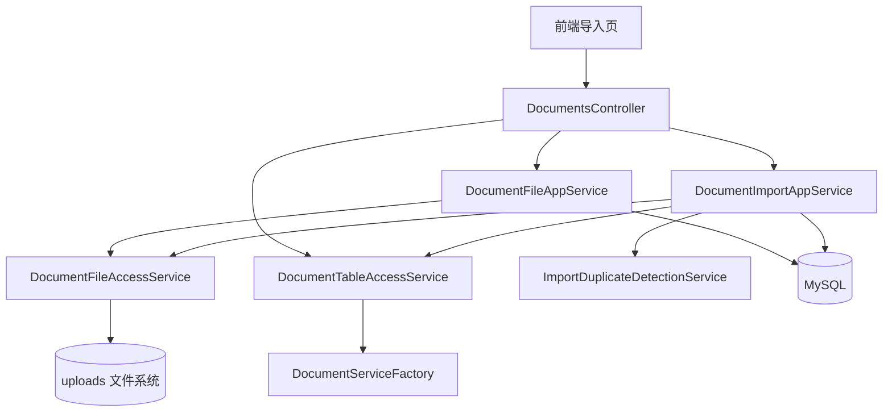

**当前结论**：
- 上传接口只负责保存文件并创建记录，返回 `tableCountReady=false`。
- 表格读取、预览、正式导入是后续独立请求，不是一次上传内完成。
- 导入阶段会先做重复检测，命中冲突时先阻断并等待前端确认。

### 2.2 上传与导入时序

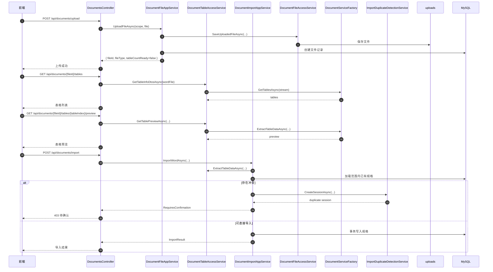

### 2.3 导入冲突分流

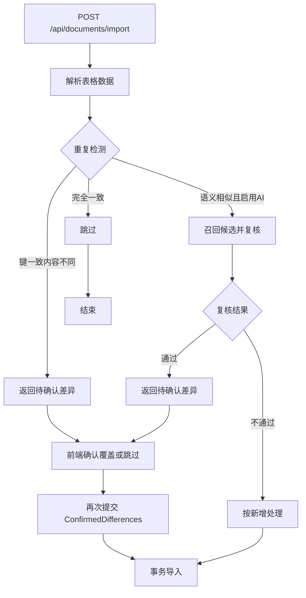

---

## 三、智能填充架构

### 3.1 智能填充组件关系

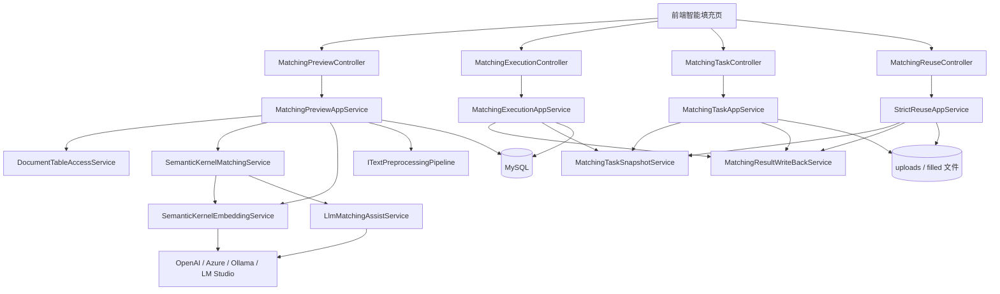

**当前结论**：
- `batch-preview` 负责算匹配结果，不直接写回文件。
- `llm-stream` 是独立复核链路，不等于 `batch-preview` 内同步决策。
- `batch-execute` 才会真正写文件并生成下载任务。
- 严格复用走 `MatchingTaskSnapshotService` 快照，不走 `MatchingWorkflowSupportService`。

### 3.2 智能填充完整时序

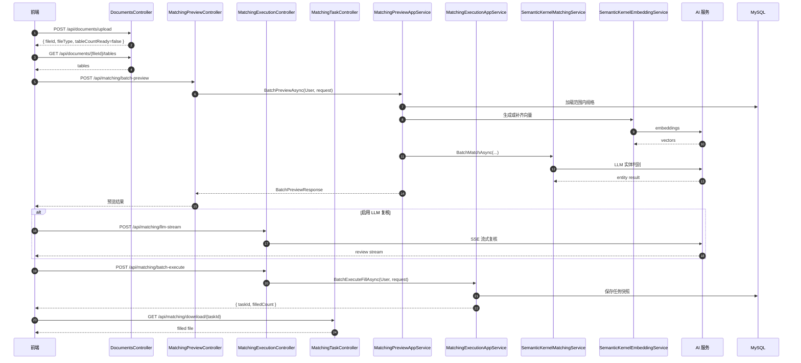

### 3.3 匹配决策与复核分流

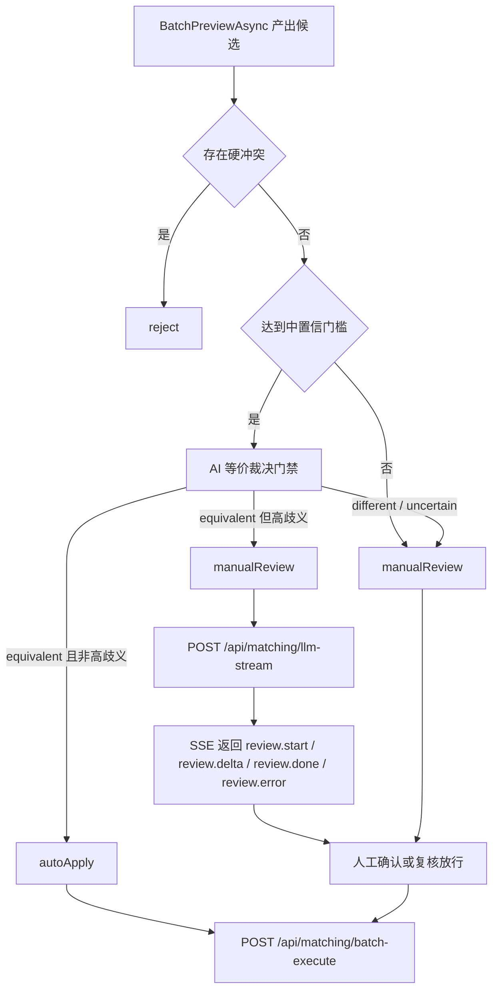

---

## 四、批量回复与严格复用

### 4.1 批量回复时序

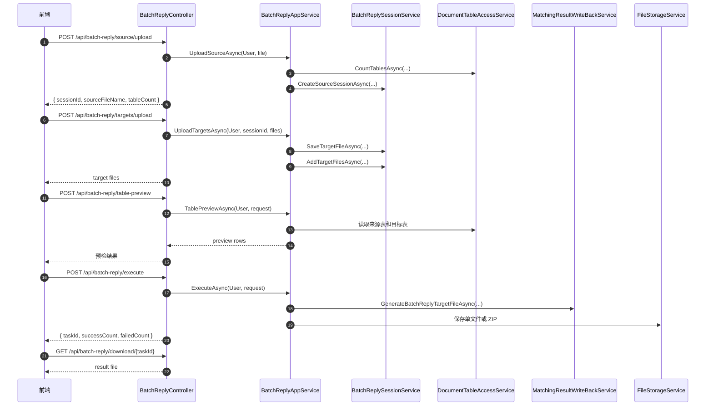

### 4.2 严格复用时序

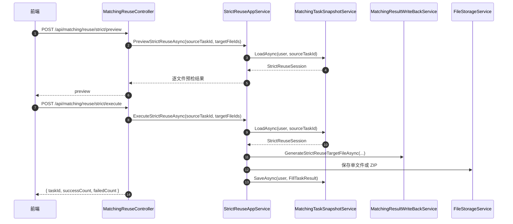

### 4.3 三条主链路差异

| 维度 | 智能填充 | 批量回复 | 严格复用 |
|------|---------|---------|---------|
| 输入方式 | 上传待填充文件 | 来源文件 + 多目标文件会话 | 基于已有智能填充任务 |
| 是否使用 AI | 是 | 否 | 否 |
| 核心依据 | 向量召回 + 规则 + LLM | 项目+规格精确对齐 | 来源任务快照 |
| 是否可人工确认 | 是 | 预检后执行 | 预检后执行 |
| 结果产物 | 单文件下载 | 单文件或 ZIP | 单文件或 ZIP |

### 4.4 失败与后续流转规则

| 场景 | 当前真实流向 |
|------|-------------|
| 智能填充 `batch-preview` 失败 | 检查 AI 服务、列配置、源文件内容后重新预览 |
| `llm-stream` 失败 | 回到当前预览结果，继续人工确认，不阻断后续执行 |
| 智能填充 `batch-execute` 失败 | 返回预览阶段调整映射后再执行 |
| 严格复用预检失败 | 当前文件不能直接套用，可改走批量回复 |
| 批量回复 `table-preview` 失败 | 调整目标文件或表配置后重新预检 |
| 批量回复 `execute` 失败 | 回到预检结果继续调整后再执行 |

---

## 五、前端入口与页面映射

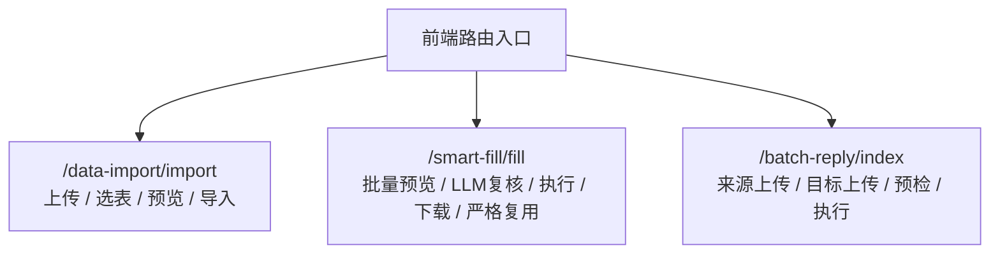

---

## 六、核对结论

- 架构图如果重点看“上传”和“智能填充”，当前主编排位置确实在 `AcceptanceSpecSystem.Api/Services`，不是 `Application`。
- 上传链路是 `upload -> tables -> preview -> import` 四段式，不是一次请求内完成。
- 智能填充分成 `batch-preview -> llm-stream(可选) -> batch-execute -> download` 四段式。
- 智能填充成功后，真实后续可以是“下载结果”或“进入严格复用”；如果要处理另一批文档，也可以转入批量回复模块，但这是独立会话，不是同一任务直通。
- 失败回退点主要落在“重新上传 / 重新预览 / 重新执行”这几个真实节点，不存在文档里画一条自动兜底成功链的情况。
- 批量回复是独立会话链路，不走 AI 匹配。
- 严格复用依赖任务快照，不重新匹配。
- 本版已主动移除数据库字段、索引、实体字段清单，避免偏离“架构图”主题。
