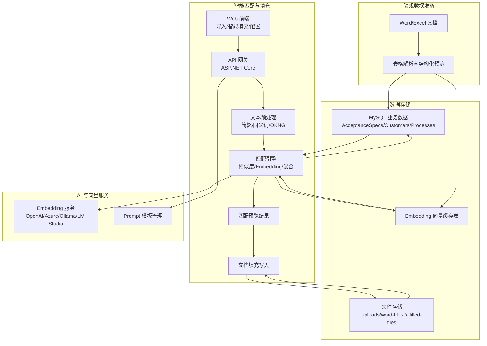

# 当前系统架构

```mermaid
flowchart TB
  %% 当前系统架构（Web + API + MySQL + Embedding）

  subgraph A[验规数据准备]
    A1[Word/Excel 文档]
    A2[表格解析与结构化预览]
  end

  subgraph B[数据存储]
    B1[MySQL 业务数据\nAcceptanceSpecs/Customers/Processes]
    B2[Embedding 向量缓存表]
    B3[文件存储\nuploads/word-files & filled-files]
  end

  subgraph C[智能匹配与填充]
    C1[Web 前端\n导入/智能填充/配置]
    C2[API 网关\nASP.NET Core]
    C3[文本预处理\n简繁/同义词/OKNG]
    C4[匹配引擎\n相似度/Embedding/混合]
    C5[匹配预览结果]
    C6[文档填充写入]
  end

  subgraph D[AI 与向量服务]
    D1[Embedding 服务\nOpenAI/Azure/Ollama/LM Studio]
    D2[Prompt 模板管理]
  end

  A1 --> A2 --> B1
  A2 --> B2

  C1 --> C2
  C2 --> C3 --> C4 --> C5
  C5 --> C6 --> B3

  C4 --> B1
  C4 --> B2
  C4 --> D1
  C2 --> D2

  B1 --> C4
  B2 --> C4
  B3 --> C6
```
