# 验收规格管理系统 — 设计概要

> **版本**: v1.0 | **日期**: 2026-03-02 | **状态**: 当前实现

---

## 目录

1. [系统定位与业务目标](#1-系统定位与业务目标)
2. [整体架构](#2-整体架构)
3. [后端分层架构](#3-后端分层架构)
4. [核心模块设计](#4-核心模块设计)
5. [数据模型设计](#5-数据模型设计)
6. [API 设计](#6-api-设计)
7. [前端架构](#7-前端架构)
8. [设计模式总览](#8-设计模式总览)
9. [测试策略](#9-测试策略)
10. [部署方案](#10-部署方案)
11. [变更管理](#11-变更管理-openspec)
12. [关键技术决策](#12-关键技术决策)

---

## 1. 系统定位与业务目标

### 1.1 核心使命

帮助企业验收工程师从历史 Word/Excel 文档中提取验收规格数据，并通过 **AI 智能匹配**自动填充到新文档中，大幅降低人工查找和手动填写的成本。

### 1.2 核心业务流程

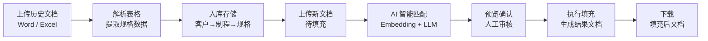

### 1.3 核心数据模型

按 **客户 (Customer) → 机型 (MachineModel) → 制程 (Process)** 层级组织验收规格：

- **查找键**：`项目 (Project) + 规格 (Specification)` — 用于匹配源文本
- **填充目标**：`验收标准 (Acceptance) + 备注 (Remark)` — 匹配后写入新文档

---

## 2. 整体架构

### 2.1 系统部署拓扑

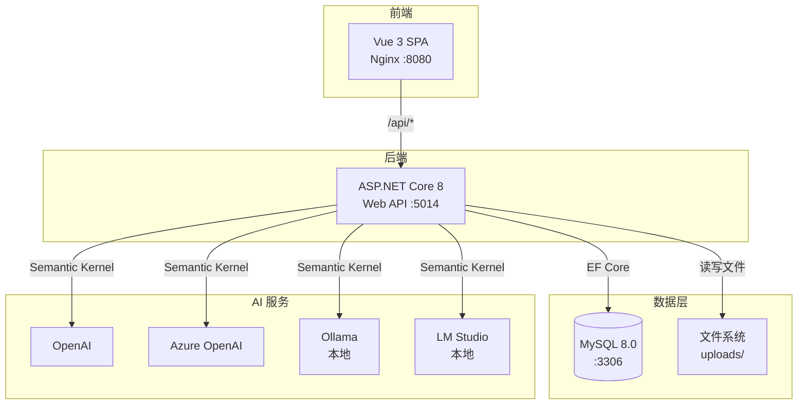

### 2.2 开发 vs 生产环境

```
开发环境:
  Vite (:8848) ──proxy /api──▶ ASP.NET Core (:5014) ──▶ MySQL (:3306)

生产环境 (Docker Compose):
  Nginx (:8080) ──proxy /api──▶ ASP.NET Core (:5014) ──▶ MySQL (:3306)
  │                              │
  └── 静态资源 (Vue dist)         └── uploads/ (Docker Volume)
```

---

## 3. 后端分层架构

### 3.1 项目依赖关系

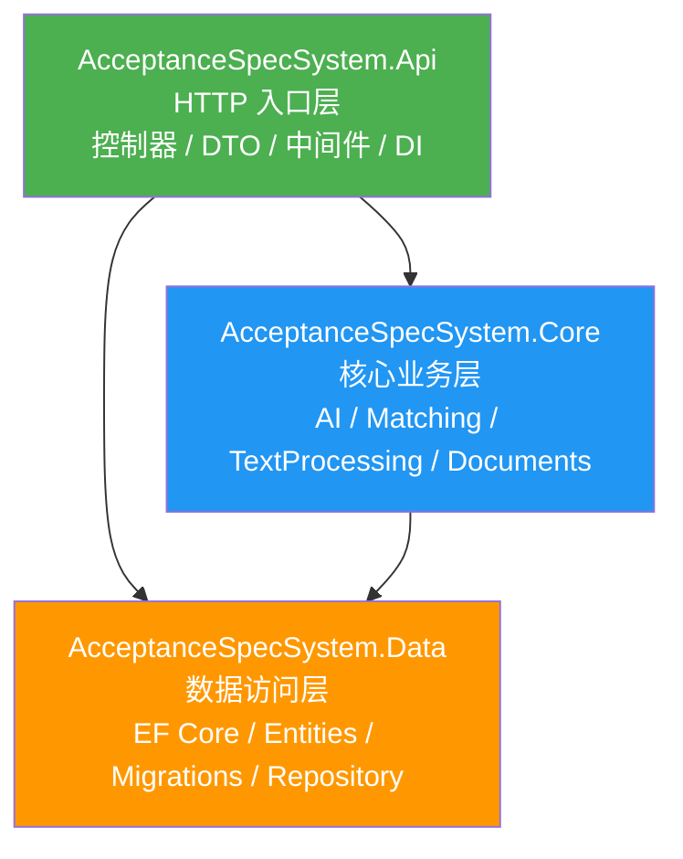

### 3.2 各层职责

| 层次 | 项目 | 职责 | 关键技术 |
|------|------|------|---------|
| **API 层** | `AcceptanceSpecSystem.Api` | HTTP 路由、请求校验、DTO 转换、DI 注册、中间件 | ASP.NET Core 8, Swagger |
| **Core 层** | `AcceptanceSpecSystem.Core` | AI 编排、匹配算法、文本预处理、文档解析与写入 | Semantic Kernel 1.68, OpenXml, ClosedXML |
| **Data 层** | `AcceptanceSpecSystem.Data` | 实体定义、DbContext、Repository、迁移 | EF Core 8, Pomelo MySQL |

**依赖规则**：
- Core 层**不依赖** API 层 → 可独立单元测试
- 控制器**不直接操作** DbContext → 通过 `IUnitOfWork` 抽象
- 启动时 `DatabaseInitializer` 自动应用待执行迁移（Testing 环境跳过）

### 3.3 DI 注册全景

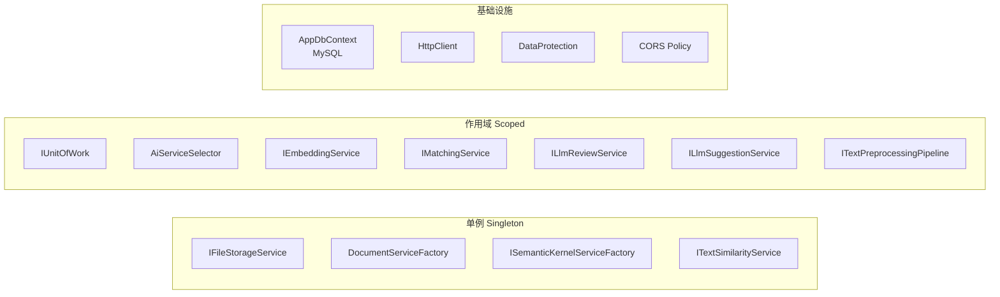

---

## 4. 核心模块设计

### 4.1 文档处理模块 (Core/Documents)

**设计模式**：工厂模式 + 策略模式

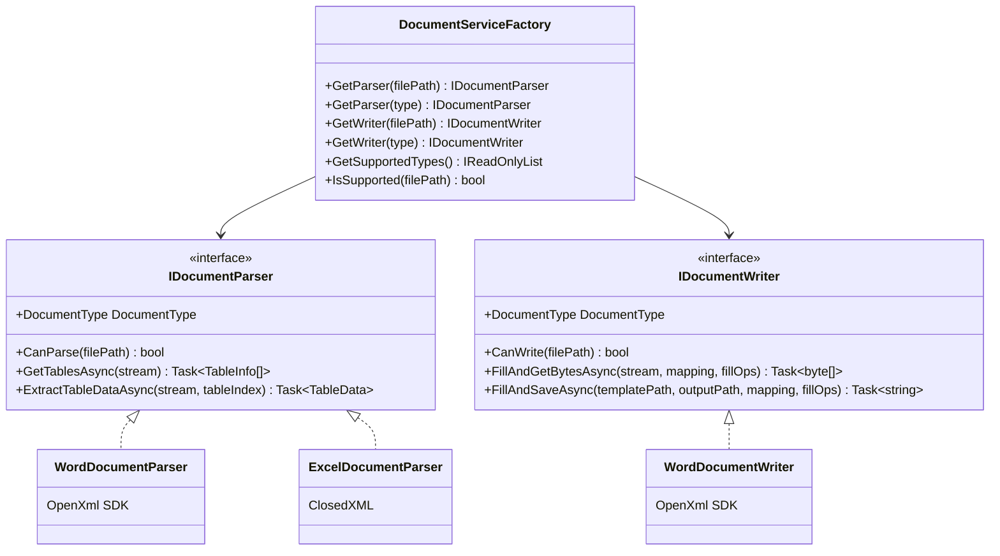

**核心数据模型**：

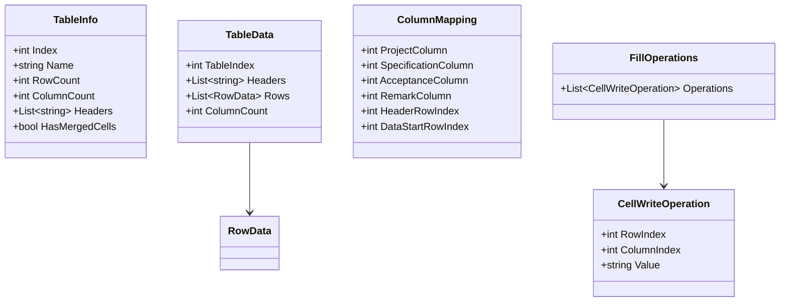

### 4.2 匹配引擎模块 (Core/Matching)

**Embedding 匹配 + LLM 辅助策略**：

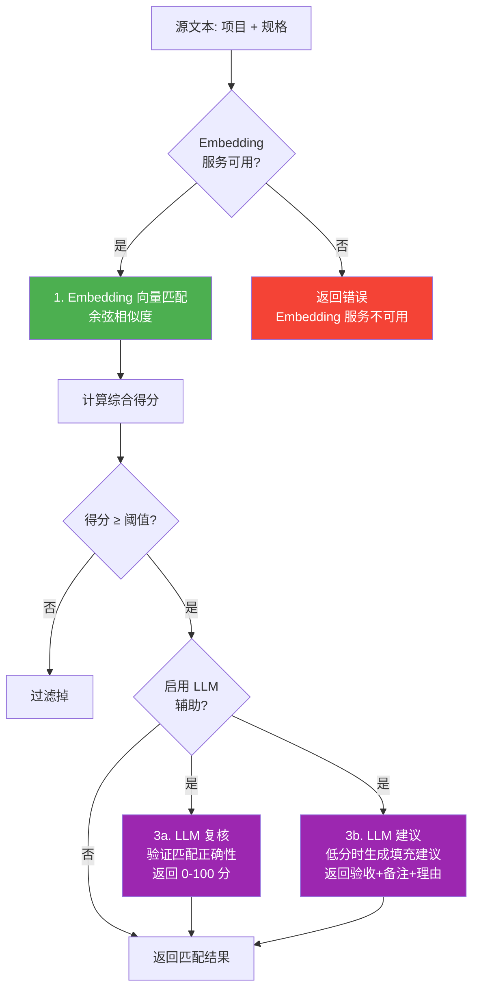

**置信度分级**：

| 等级 | 分数范围 | 颜色 | 处理策略 |
|------|---------|------|---------|
| 高置信 | ≥ 0.8 | 🟢 | 推荐自动填充 |
| 中置信 | 0.6 ~ 0.8 | 🟡 | 建议填充，用户确认 |
| 低置信 | < 0.6 | 🔴 | 触发 LLM 建议（可选） |

**匹配结果模型**：

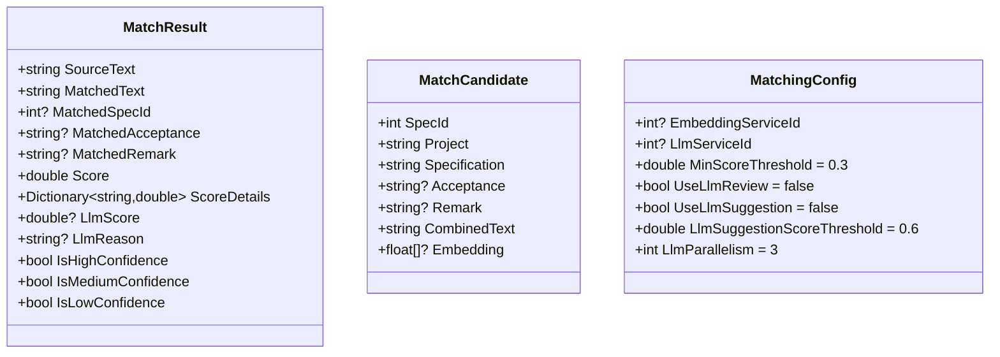

**Embedding 缓存机制**：

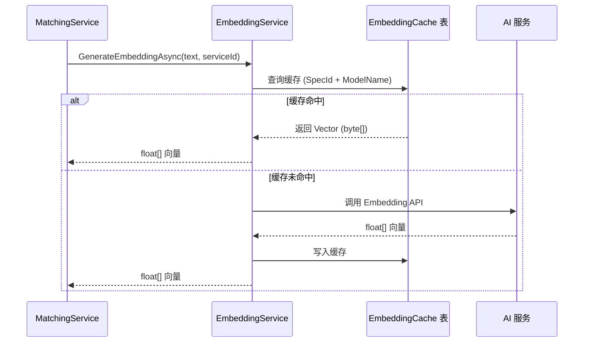

### 4.3 AI 服务管理 (Core/AI/SemanticKernel)

**设计模式**：工厂模式 + 服务选择器

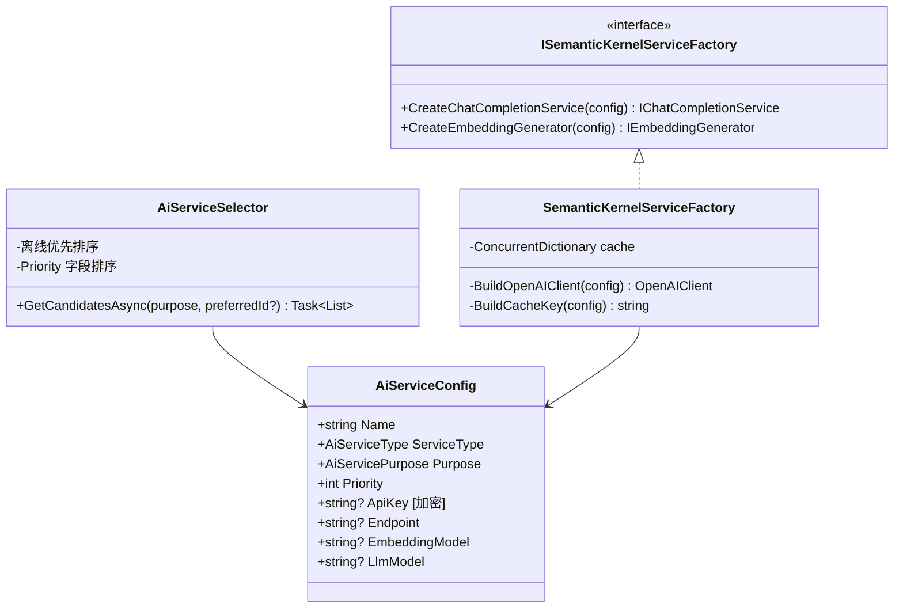

**多提供商支持矩阵**：

| 提供商 | 类型 | LLM | Embedding | 协议 | 优先级 |
|--------|------|-----|-----------|------|--------|
| OpenAI | 云端 | ✅ | ✅ | OpenAI API | 默认 |
| Azure OpenAI | 云端 | ✅ | ✅ | Azure API | 默认 |
| Ollama | 本地 | ✅ | ✅ | OpenAI 兼容 | 离线优先 |
| LM Studio | 本地 | ✅ | ✅ | OpenAI 兼容 | 离线优先 |
| 自定义兼容 | 任意 | ✅ | ✅ | OpenAI 兼容 | 自定义 |

**服务选择流程**：

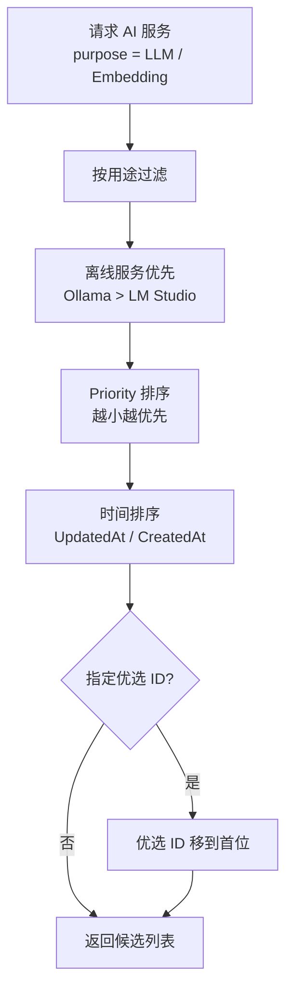

### 4.4 文本预处理管道 (Core/TextProcessing)

**设计模式**：管道模式 (Pipeline)

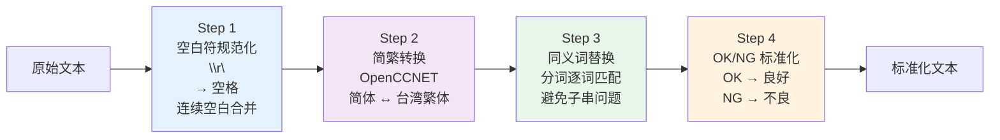

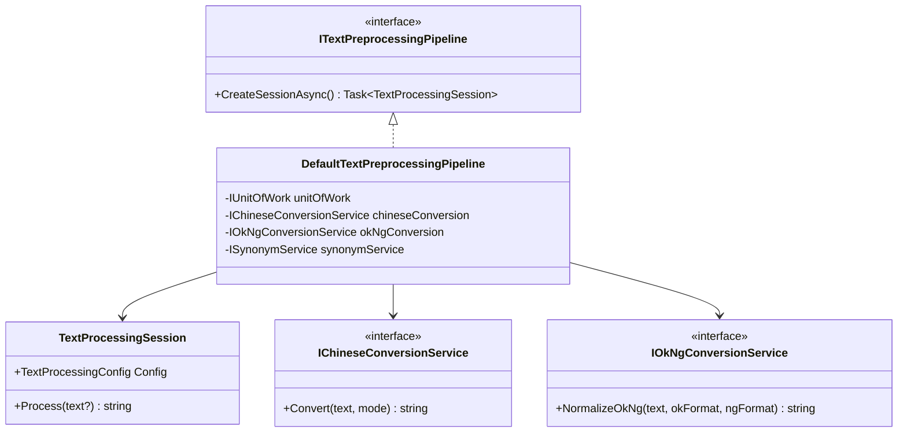

---

## 5. 数据模型设计

### 5.1 实体关系图 (ER Diagram)

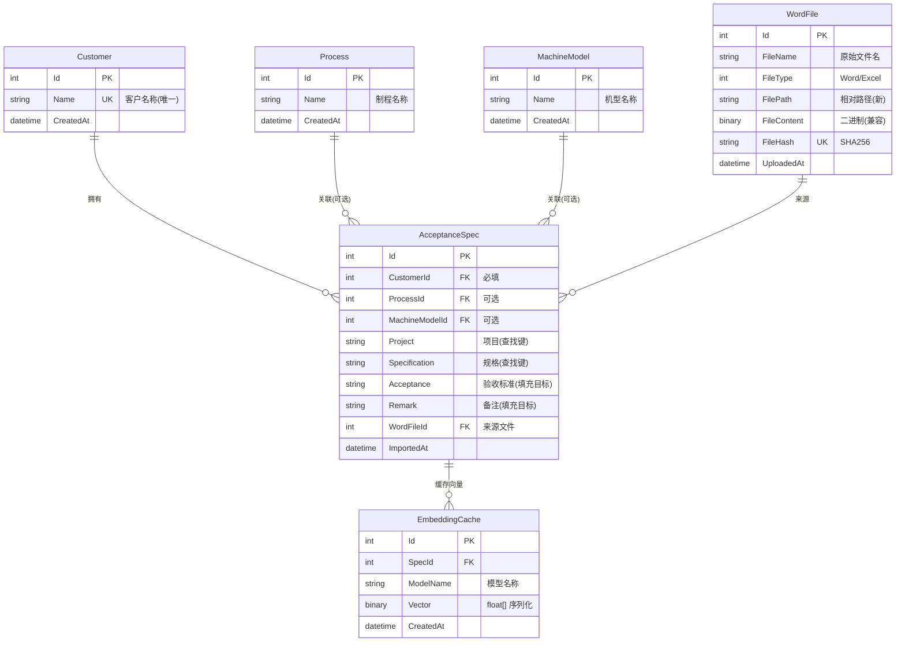

### 5.2 配置实体关系

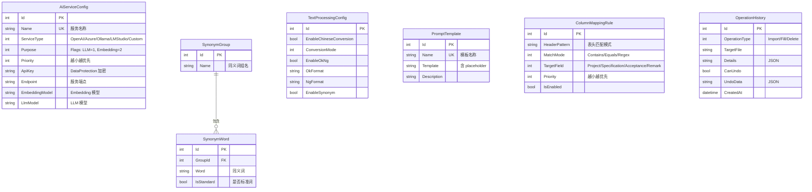

### 5.3 核心索引策略

| 实体 | 索引 | 类型 |
|------|------|------|
| `AcceptanceSpec` | `(CustomerId, ProcessId, MachineModelId)` | 复合索引 |
| `EmbeddingCache` | `(SpecId, ModelName)` | 复合唯一索引 |
| `WordFile` | `FileHash` | 唯一索引 |
| `AiServiceConfig` | `Name` | 唯一索引 |
| `Customer` | `Name` | 唯一索引 |

---

## 6. API 设计

### 6.1 统一响应格式

```json
{
  "code": 0,
  "message": "操作成功",
  "data": { "..." }
}
```

**错误码映射**：

| 异常类型 | HTTP 状态码 | 说明 |
|---------|------------|------|
| `ArgumentException` | 400 | 参数校验失败 |
| `InvalidOperationException` | 400 | 业务规则违反 |
| `KeyNotFoundException` | 404 | 资源不存在 |
| `UnauthorizedAccessException` | 401 | 未授权 |
| 其他异常 | 500 | 内部服务器错误 |

### 6.2 端点全景

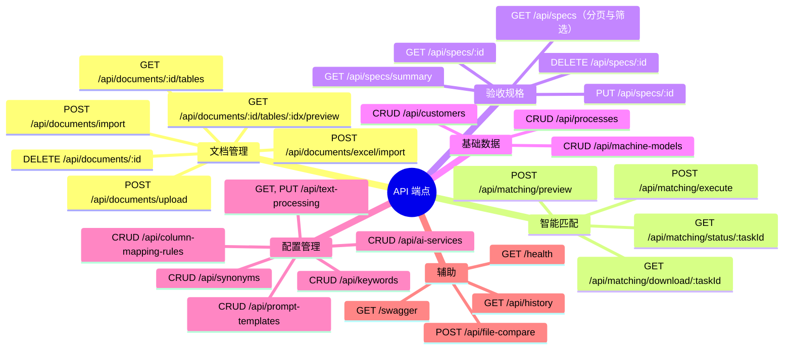

### 6.3 核心端点详解

#### 文档处理流程

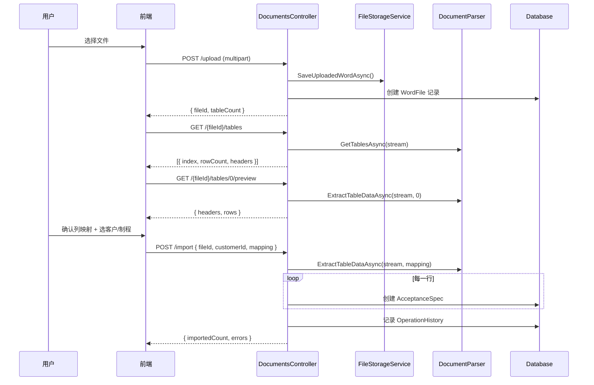

#### 匹配填充流程

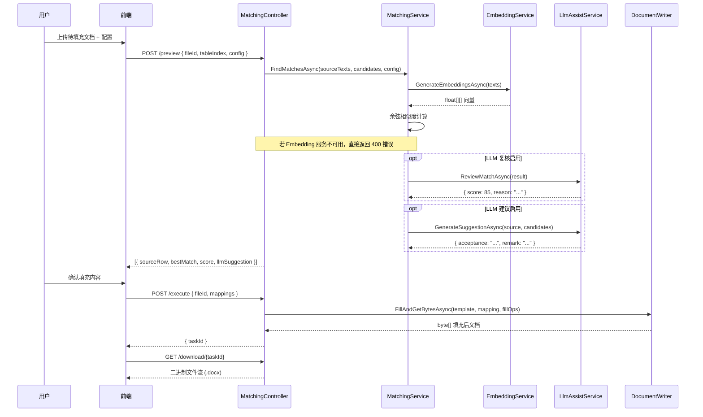

---

## 7. 前端架构

### 7.1 技术栈

| 层次 | 技术选型 | 版本 |
|------|---------|------|
| 框架 | Vue 3 (Composition API) | 3.5.22 |
| 语言 | TypeScript | 5.9.3 |
| 构建 | Vite + pnpm | 7.1.12 |
| UI 库 | Element Plus | 2.11.5 |
| 样式 | Tailwind CSS | 4.1.16 |
| 状态 | Pinia | 3.0.3 |
| HTTP | Axios（封装 PureHttp） | 1.12.2 |
| 表格 | @pureadmin/table | 3.3.0 |
| 模板 | Pure Admin Thin | — |

### 7.2 前端目录结构

```
web/src/
├── main.ts                         应用入口
├── App.vue                         根组件 (ElConfigProvider 中文化)
├── api/                            API 封装层 (16 个模块)
│   ├── customer.ts                 客户 API
│   ├── process.ts                  制程 API
│   ├── machine-model.ts            机型 API
│   ├── spec.ts                     规格 API
│   ├── document.ts                 文档 API
│   ├── matching.ts                 匹配 API (长超时 300s)
│   ├── ai-service.ts               AI 服务 API
│   ├── text-processing.ts          文本处理 API
│   ├── prompt-template.ts          Prompt 模板 API
│   ├── column-mapping-rules.ts     列映射规则 API
│   ├── synonym.ts                  同义词 API
│   ├── keyword.ts                  关键词 API
│   ├── history.ts                  历史 API
│   ├── file-compare.ts             文件对比 API
│   └── user.ts                     用户认证 API
├── router/modules/                 路由模块
├── store/modules/                  Pinia 状态 (app/user/permission/...)
├── views/                          页面视图
├── components/                     全局可复用组件
├── directives/                     自定义指令 (auth/perms/copy/...)
├── layout/                         全局布局 (侧边栏/导航栏/标签页)
├── utils/                          工具函数 (http/auth/message/...)
└── style/                          全局样式 (theme/dark/element-plus/...)
```

### 7.3 功能模块地图

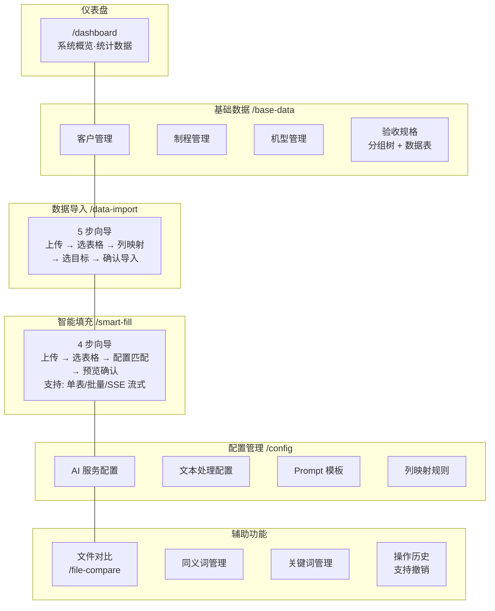

### 7.4 智能填充交互流程

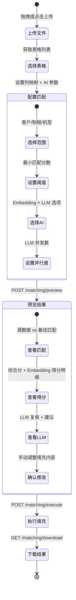

### 7.5 前端关键设计

| 特性 | 实现方式 | 说明 |
|------|---------|------|
| **多步向导** | `currentStep` ref + `canGoNext` computed | 降低用户认知负担 |
| **列映射自动识别** | `ColumnMappingRule` 优先级匹配 | Contains / Equals / Regex 三种模式 |
| **SSE 流式** | EventSource + AbortController | LLM 实时进度推送 |
| **长超时** | Axios 300s + Vite proxy timeout=0 | 适配 AI 长耗时请求 |
| **Token 刷新** | PureHttp 拦截器队列 | 无感刷新，请求不丢失 |
| **权限控制** | v-auth / v-perms 指令 + Pinia | 页面级 + 按钮级 |
| **主题切换** | epTheme store + CSS 变量 | 深色/浅色模式 |

---

## 8. 设计模式总览

```mermaid
graph TB
    subgraph 创建型模式
        F1[工厂模式<br/>DocumentServiceFactory<br/>SemanticKernelServiceFactory]
    end

    subgraph 结构型模式
        S1[适配器模式<br/>多格式文档解析]
        S2[缓存模式<br/>EmbeddingCache<br/>ServiceFactory 实例缓存]
    end

    subgraph 行为型模式
        B1[策略模式<br/>IDocumentParser<br/>IMatchingService]
        B2[管道模式<br/>TextPreprocessingPipeline]
        B3[服务选择器<br/>AiServiceSelector]
    end

    subgraph 架构模式
        A1[仓储模式<br/>IRepository + 特化 Repository]
        A2[工作单元<br/>IUnitOfWork]
        A3[显式失败模式<br/>Embedding 不可用即返回错误]
    end
```

| 模式 | 应用位置 | 解决的问题 |
|------|---------|-----------|
| **工厂模式** | `DocumentServiceFactory`, `SemanticKernelServiceFactory` | 解耦创建逻辑，支持多格式/多 AI 提供商 |
| **策略模式** | `IDocumentParser`, `IMatchingService` | 算法可替换（Word/Excel、Embedding/LLM辅助） |
| **仓储模式** | `IRepository<T>` + 12 个特化 Repository | 数据访问抽象，屏蔽 EF Core 细节 |
| **工作单元** | `IUnitOfWork` (13 个 Repository 聚合) | 事务管理、SaveChanges 统一 |
| **管道模式** | `DefaultTextPreprocessingPipeline` | 文本处理步骤解耦、可配置 |
| **显式失败模式** | `SemanticKernelMatchingService` | Embedding 不可用时直接返回明确错误 |
| **缓存模式** | `EmbeddingCache` 表, `ConcurrentDictionary` | 避免重复 AI 调用和连接创建 |
| **服务选择器** | `AiServiceSelector` | 动态选择最优 AI 服务（离线优先 + 优先级排序） |
| **适配器模式** | `DocumentServiceFactory` | 统一不同格式文档的解析/写入接口 |

---

## 9. 测试策略

### 9.1 测试金字塔

```mermaid
graph TB
    subgraph "E2E 测试 (tools/E2ETest)"
        E2E[控制台 CLI<br/>真实 HTTP 流程<br/>上传→导入→预览→填充→下载]
    end

    subgraph "API 集成测试 (Api.Tests)"
        API_T[13 个测试类<br/>WebApplicationFactory + SQLite<br/>覆盖完整业务流程]
    end

    subgraph "Core 单元测试 (Core.Tests)"
        CORE_T[匹配算法测试<br/>文档解析/写入测试<br/>异常路径测试]
    end

    subgraph "Data 仓储测试 (Data.Tests)"
        DATA_T[Repository CRUD<br/>UnitOfWork 事务<br/>EF Core InMemory]
    end

    E2E --> API_T --> CORE_T --> DATA_T

    style E2E fill:#F44336,color:#fff
    style API_T fill:#FF9800,color:#fff
    style CORE_T fill:#4CAF50,color:#fff
    style DATA_T fill:#2196F3,color:#fff
```

### 9.2 测试基础设施

```mermaid
classDiagram
    class ApiWebApplicationFactory {
        -SQLite InMemory 替换 MySQL
        -TestFileStorageService 替换文件存储
        -TestEmbeddingService 替换 Embedding
        -TestLlmReviewService 替换 LLM 复核
        -TestLlmSuggestionService 替换 LLM 建议
        -Ephemeral DataProtection
        +CreateClient() HttpClient
    }

    class TestEmbeddingService {
        +GenerateEmbeddingAsync() float[]
        确定性: 字符桶化生成 16 维向量
    }

    class TestLlmReviewService {
        +ReviewMatchAsync() LlmReviewResult
        固定: score=0.4, reason, commentary
    }

    class TestLlmSuggestionService {
        +GenerateSuggestionAsync() LlmSuggestionResult
        固定: acceptance, remark, reason
    }

    ApiWebApplicationFactory --> TestEmbeddingService
    ApiWebApplicationFactory --> TestLlmReviewService
    ApiWebApplicationFactory --> TestLlmSuggestionService
```

### 9.3 测试覆盖矩阵

| 层次 | 测试项目 | 数据库 | 模式 | 测试文件数 |
|------|---------|--------|------|-----------|
| **API** | `Api.Tests` | SQLite InMemory | `WebApplicationFactory` + `IClassFixture` | 13 |
| **Core** | `Core.Tests` | 无（纯单元） | 依赖注入 + Mock | 5 |
| **Data** | `Data.Tests` | EF InMemory | `TestBase` 抽象基类 | 3 |
| **E2E** | `tools/E2ETest` | 真实服务器 | Console CLI + HTTP | 1 |

---

## 10. 部署方案

### 10.1 Docker Compose 架构

```mermaid
graph LR
    subgraph Docker Network
        NGINX["acceptance-web<br/>Nginx :80<br/>(暴露 :8080)"]
        API_D["acceptance-api<br/>ASP.NET Core :8080<br/>(暴露 :5014)"]
        MYSQL["acceptance-mysql<br/>MySQL 8.0 :3306"]
    end

    subgraph Volumes
        V1[(mysql_data)]
        V2[(api_uploads)]
    end

    NGINX -- "/api/*" --> API_D
    API_D -- "EF Core" --> MYSQL
    MYSQL --- V1
    API_D --- V2

    style NGINX fill:#4CAF50,color:#fff
    style API_D fill:#2196F3,color:#fff
    style MYSQL fill:#FF9800,color:#fff
```

### 10.2 构建流程

```mermaid
graph TD
  subgraph API_BUILD["API 构建 · 多阶段 Dockerfile"]
    A1["SDK 8.0 镜像"] --> A2["dotnet restore"]
    A2 --> A3["dotnet publish -c Release"]
    A3 --> A4["Runtime 8.0 镜像<br/>:8080"]
  end

  subgraph WEB_BUILD["Web 构建 · 多阶段 Dockerfile"]
    W1["Node 20 Alpine"] --> W2["pnpm install --frozen-lockfile"]
    W2 --> W3["pnpm build"]
    W3 --> W4["Nginx Alpine<br/>:80"]
  end

  subgraph COMPOSE["Compose"]
    DC["docker compose up -d --build"]
    DC --> A1
    DC --> W1
    DC --> MYSQL_INIT["MySQL 8.0<br/>健康检查后启动 API"]
  end
```

### 10.3 环境对照

| 配置项 | 开发环境 | 生产环境 (Docker) |
|--------|---------|-----------------|
| 前端端口 | Vite :8848 | Nginx :8080 |
| 后端端口 | :5014 | :5014 (映射自 :8080) |
| 数据库 | localhost:3306 | acceptance-mysql:3306 |
| API 代理 | Vite proxy | Nginx proxy |
| 文件存储 | 本地 uploads/ | Docker Volume api_uploads |
| 迁移 | 自动应用 | 自动应用 |
| Swagger | 启用 | 启用 |

---

## 11. 变更管理 (OpenSpec)

### 11.1 规格体系

```mermaid
graph TB
    subgraph "openspec/specs/ (当前系统真相)"
        S1[api/spec.md<br/>API 接口规格]
        S2[data-storage/spec.md<br/>数据存储规格]
        S3[file-storage/spec.md<br/>文件存储规格]
        S4[matching-engine/spec.md<br/>匹配引擎规格]
        S5[table-preview/spec.md<br/>表格预览规格]
        S6[user-interface/spec.md<br/>用户界面规格]
    end

    subgraph "openspec/changes/archive/ (已完成变更)"
        C1[refactor-specset-model<br/>数据模型重构]
        C2[add-machine-model<br/>机型管理]
        C3[add-file-compare<br/>文件对比]
        C4[add-excel-import<br/>Excel 导入]
        C5[add-column-mapping-rules<br/>列映射规则]
        C6[refactor-ai-stack-to-sk<br/>Semantic Kernel 重构]
        C7[update-to-web-architecture<br/>Web 架构升级]
        C8[add-llm-matching-assist<br/>LLM 辅助匹配]
    end

    C1 -.->|影响| S2
    C6 -.->|影响| S4
    C7 -.->|影响| S6
    C8 -.->|影响| S4
    C8 -.->|影响| S6
```

### 11.2 变更流程

```mermaid
flowchart LR
    P[提案 proposal.md<br/>动机·影响·范围] --> D[设计 design.md<br/>技术决策]
    D --> T[任务 tasks.md<br/>实施清单]
    T --> I[实施<br/>编码·测试]
    I --> V[验证<br/>规格校验]
    V --> A[归档<br/>archive/]
```

---

## 12. 关键技术决策

| # | 决策 | 选择 | 备选方案 | 理由 |
|---|------|------|---------|------|
| 1 | AI 编排框架 | **Semantic Kernel 1.68** | LangChain.NET, 直接调用 | 原生 .NET，统一多提供商接口，微软官方维护 |
| 2 | 匹配策略 | **Embedding 主匹配（失败即报错）** | 多算法混合匹配 | 保持结果一致性，避免不同算法导致的语义偏差 |
| 3 | 文档处理 | **OpenXml + ClosedXML** | NPOI, Aspose | 无需安装 Office，MIT 开源，跨平台 |
| 4 | 简繁转换 | **OpenCCNET** | 简单字符映射 | 支持台湾用语习惯，非简单一对一映射 |
| 5 | 前端框架 | **Vue 3 + Pure Admin Thin** | React, Angular | 成熟企业管理后台方案，中文社区活跃 |
| 6 | 数据库 | **MySQL 8.0 (Pomelo)** | PostgreSQL, SQLite | 生产级 RDBMS，EF Core Migration 管理 Schema |
| 7 | 向量存储 | **数据库表 (EmbeddingCache)** | Milvus, Qdrant, pgvector | 简单直接，规模可控，无需引入额外基础设施 |
| 8 | 文件存储 | **文件系统（相对路径）** | 数据库 BLOB, MinIO | 便于跨环境迁移，Docker Volume 持久化 |
| 9 | AI 服务选择 | **离线优先 + 优先级排序** | 固定服务 | 支持断网环境，灵活切换提供商 |
| 10 | 文本预处理 | **管道模式（可配置步骤）** | 硬编码处理链 | 步骤可独立开关，运行时加载配置 |

---

## 附录 A：技术栈全景

### 后端依赖

| 包 | 版本 | 用途 |
|----|------|------|
| ASP.NET Core | 8.0 | Web API 框架 |
| EF Core | 8.0.22 | ORM |
| Pomelo.EntityFrameworkCore.MySql | 8.0.3 | MySQL 驱动 |
| Microsoft.SemanticKernel | 1.68.0 | AI 编排 |
| Microsoft.SemanticKernel.Connectors.OpenAI | 1.68.0 | OpenAI 连接器 |
| DocumentFormat.OpenXml | 3.4.1 | Word 文档处理 |
| ClosedXML | 0.104.2 | Excel 文档处理 |
| OpenCCNET | 1.1.0 | 简繁转换 |
| Swashbuckle.AspNetCore | 6.6.2 | Swagger/OpenAPI |

### 前端依赖

| 包 | 版本 | 用途 |
|----|------|------|
| Vue | 3.5.22 | UI 框架 |
| Vue Router | 4.6.3 | 路由 |
| Pinia | 3.0.3 | 状态管理 |
| Axios | 1.12.2 | HTTP 客户端 |
| Element Plus | 2.11.5 | UI 组件库 |
| Tailwind CSS | 4.1.16 | 原子化样式 |
| TypeScript | 5.9.3 | 类型安全 |
| Vite | 7.1.12 | 构建工具 |
| @pureadmin/table | 3.3.0 | 高级数据表格 |

### 测试依赖

| 包 | 版本 | 用途 |
|----|------|------|
| xUnit | 2.5.3 | 测试框架 |
| FluentAssertions | 8.8.0 | 断言库 |
| Microsoft.AspNetCore.Mvc.Testing | 8.0.22 | 集成测试 |
| EF Core SQLite | 8.0.22 | 测试数据库 |
| EF Core InMemory | 8.0.22 | 单元测试数据库 |
| coverlet.collector | 6.0.0 | 代码覆盖率 |

---

## 附录 B：数据流全景

```mermaid
graph TB
    subgraph 导入阶段
        U1[用户上传 Word/Excel] --> UPLOAD[FileStorageService<br/>保存到文件系统]
        UPLOAD --> PARSE[DocumentParser<br/>解析表格结构]
        PARSE --> MAP[ColumnMapping<br/>列映射配置]
        MAP --> IMPORT[逐行创建 AcceptanceSpec<br/>写入数据库]
        IMPORT --> HIST1[记录 OperationHistory]
    end

    subgraph 匹配阶段
        U2[用户上传待填充文档] --> EXTRACT[提取源文本<br/>项目 + 规格]
        EXTRACT --> CAND[加载候选规格<br/>按客户/制程/机型筛选]
        CAND --> PREPROC[文本预处理管道<br/>简繁·同义词·OK/NG]
        PREPROC --> EMBCHK{Embedding 服务可用?}
        EMBCHK -- 是 --> VEC[向量匹配<br/>余弦相似度]
        VEC --> SCORE[综合得分排序]
        SCORE --> LLM_OPT{LLM 启用?}
        EMBCHK -- 否 --> ERR[返回错误]
        LLM_OPT -- 是 --> LLM_PROC[LLM 复核 + 建议]
        LLM_OPT -- 否 --> PREVIEW
        LLM_PROC --> PREVIEW[返回预览结果]
    end

    subgraph 填充阶段
        PREVIEW --> CONFIRM[用户确认/修改]
        CONFIRM --> FILL_OPS[构建 FillOperations<br/>CellWriteOperation 列表]
        FILL_OPS --> WRITER[WordDocumentWriter<br/>写入目标文档]
        WRITER --> SAVE[保存填充结果<br/>filled-files/]
        SAVE --> DL[用户下载]
        SAVE --> HIST2[记录 OperationHistory]
    end
```

---

> 文档生成时间: 2026-03-02
