# AcceptanceSpecificationSystem — 流程图与时序图

> 以下图表使用 [Mermaid](https://mermaid.js.org/) 语法，可直接在支持 Mermaid 的编辑器（如 VS Code + Mermaid 插件、Typora、Obsidian）中渲染。

---

## 一、整体业务流程总览

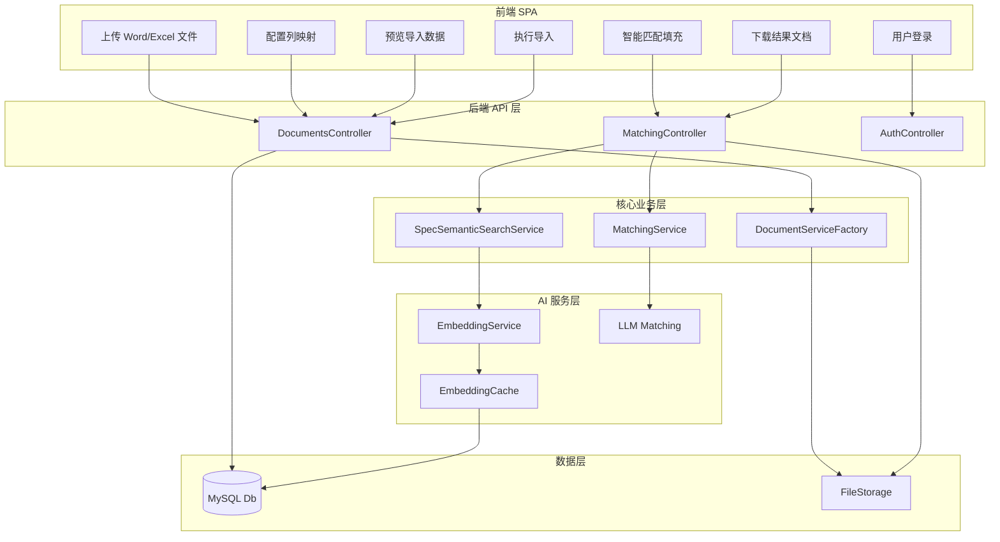

---

## 二、文件上传与导入流程

### 2.1 文件上传时序图

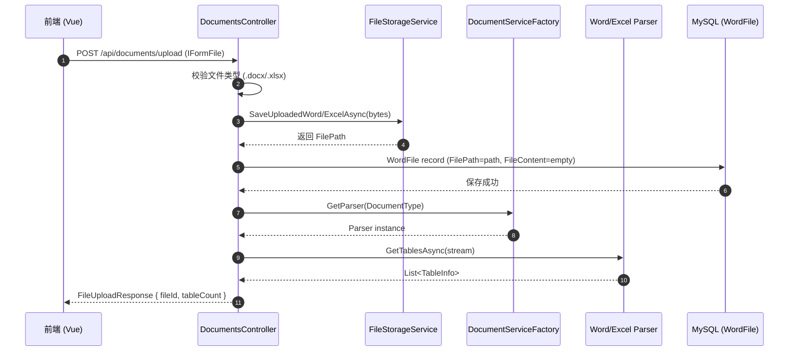

### 2.2 导入验收规格流程（Word）

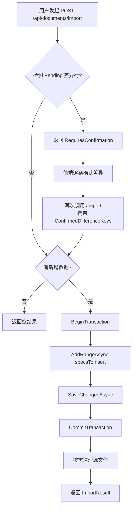

### 2.3 导入事务边界说明

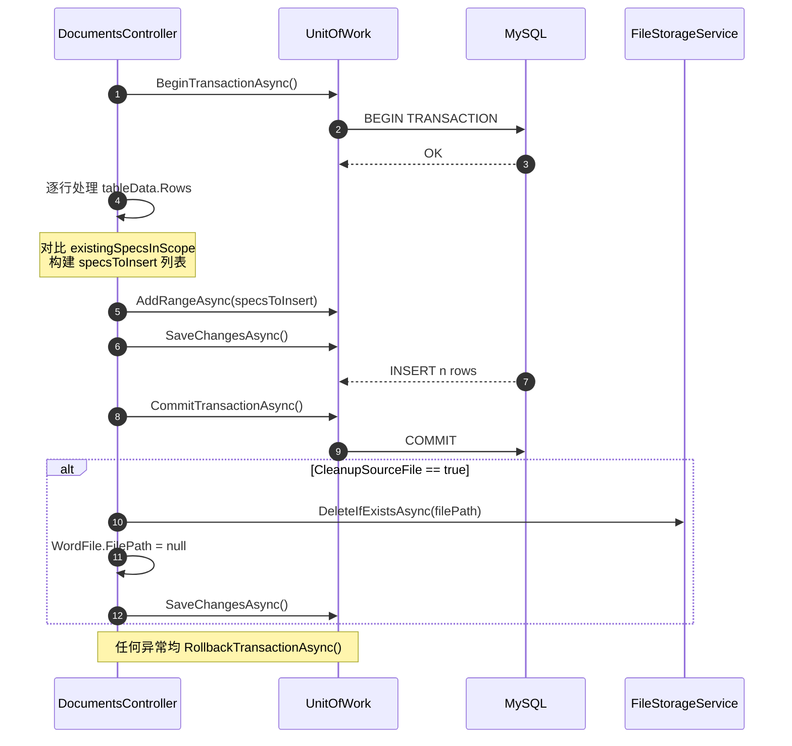

---

## 三、智能匹配填充流程

### 3.1 匹配预览（BatchPreview）完整时序

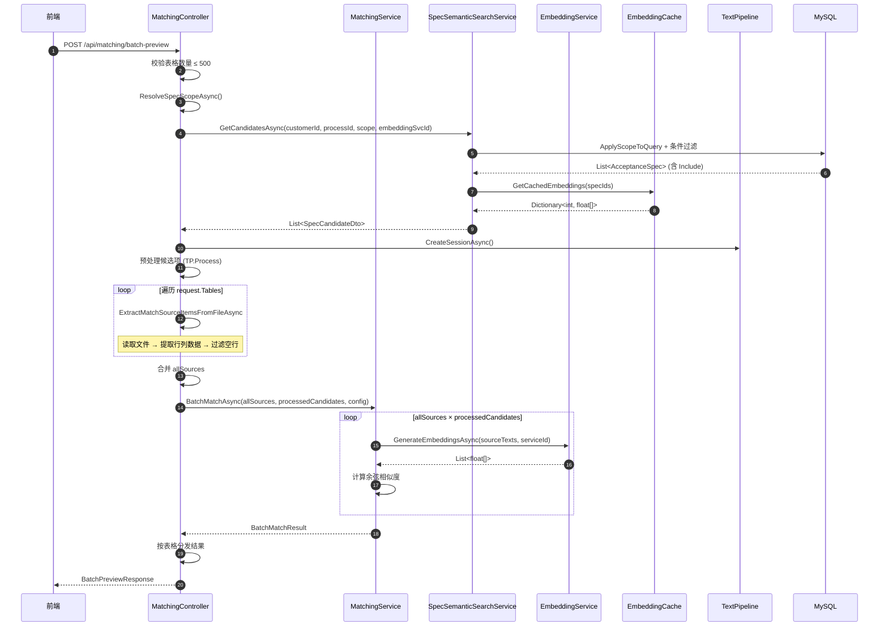

### 3.2 匹配执行（BatchExecuteFill）流程

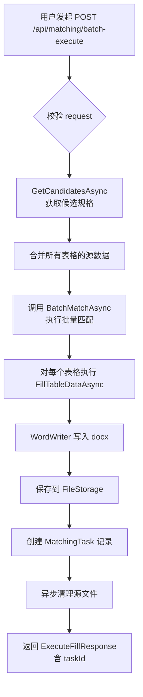

### 3.3 Embedding 缓存命中流程

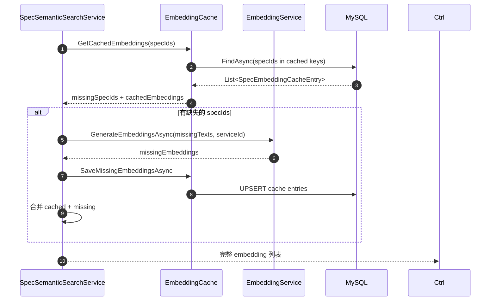

---

## 四、用户认证与数据权限流程

### 4.1 登录与 JWT 颁发时序

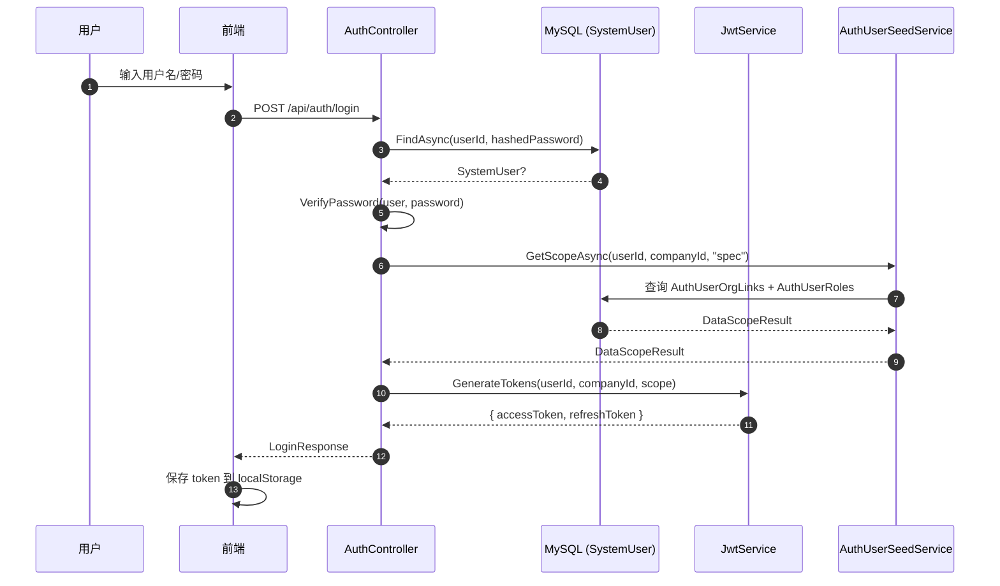

### 4.2 数据权限范围解析流程

```mermaid
flowchart TD
    A[请求进入 API] --> B[从 JWT 解析<br/>userId + companyId]
    B --> C[AuthDataScopeService<br/>GetScopeAsync]
    C --> D{查询 AuthUserOrgLinks}
    D --> E[获取用户所属组织单元列表]
    E --> F{查询 AuthUserRoles}
    F --> G[获取角色关联的 DataScopes]
    G --> H{遍历每个 Scope}
    H --> I{ScopeType = IsAll?}
    I -- 是 --> J[返回 IsAll = true]
    I -- 否 --> K{ScopeType = OrgNode?}
    K -- 是 --> L[返回 OrgUnitIds<br/>= 直接关联的组织单元]
    K -- 否 --> M{ScopeType = OrgSubtree?}
    M -- 是 --> N[构建 idToAncestors<br/>向上回溯所有祖先节点]
    M -- 否 --> O[IncludeSelf 扩展]
    N --> P[返回完整祖先链集合]
    O --> P
    P --> Q[合并所有 Scope<br/>去重后返回 DataScopeResult]

    subgraph 数据库查询
    D1[SELECT FROM AuthUserOrgLinks<br/>WHERE UserId = ?]
    D2[SELECT FROM AuthUserRoles<br/>WHERE UserId = ?]
    D3[SELECT FROM AuthRoleDataScopes<br/>WHERE RoleId IN (...)]
    D4[SELECT FROM OrgUnits<br/>WHERE CompanyId = ?]
    end

    D --> D1
    F --> D2
    D3 --> G
    D4 --> N
```

---

## 五、EmbeddingCache 缓存失效与更新

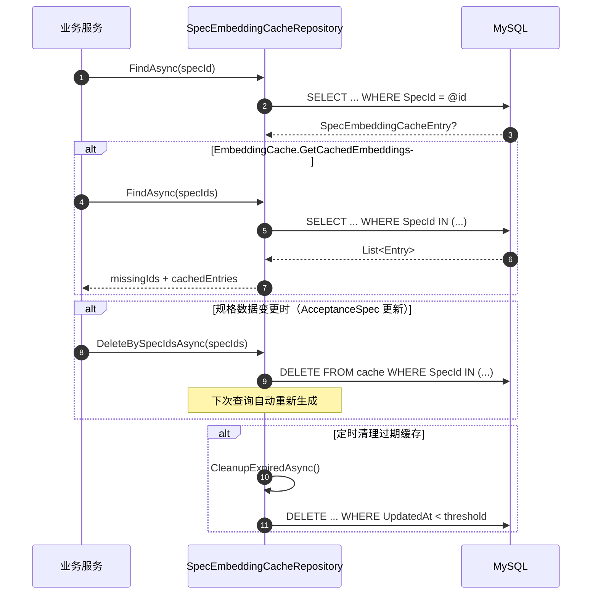

---

## 六、前后端交互全景时序

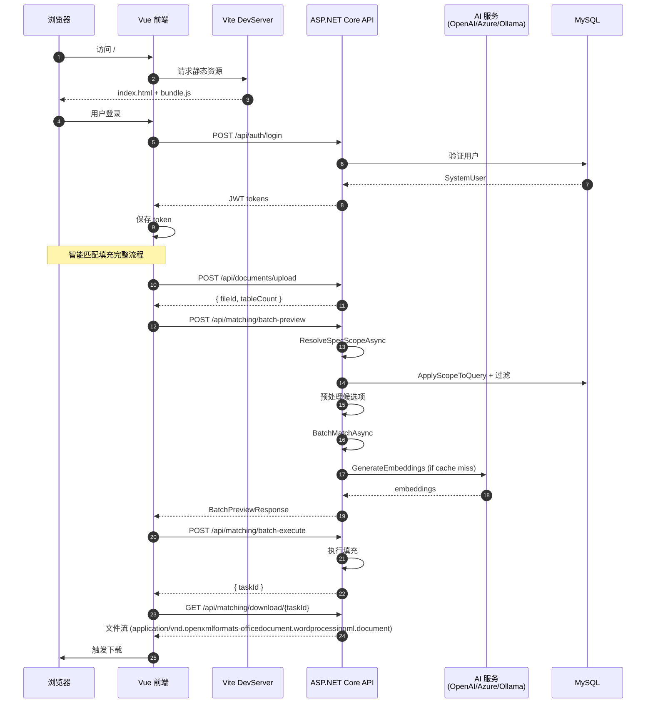

---

## 七、核心数据模型关系

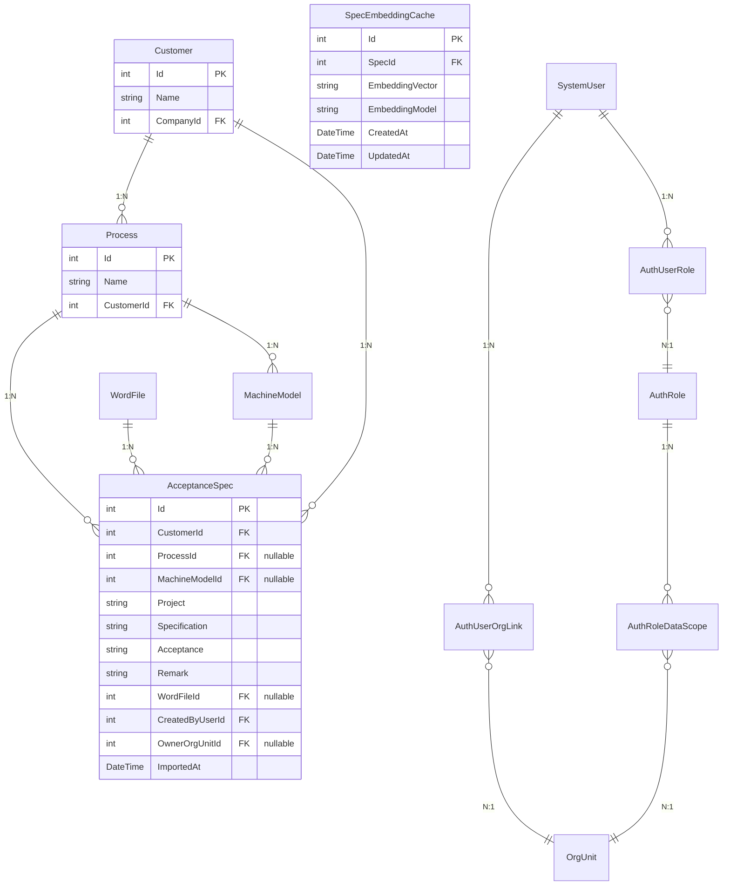

---

*图表生成时间：2026-03-23 | 基于 AcceptanceSpecificationSystem 项目当前代码状态*
