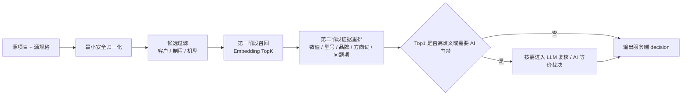

# 基于真实样本文档的匹配评估与多阶段召回重排说明

> 说明：本文最初用于评估是否引入多阶段召回重排。当前分支已落地为固定的服务端多阶段证据驱动链路，文中涉及 `UseLlmReview`、`UseLlmSuggestion`、`MatchingStrategy` 等旧开关的描述已按现行实现修订。

## 1. 目的

本文档基于两份真实样本文档，对当前验规系统的导入、匹配和填充能力进行一次面向业务的评估，并说明当前分支已经采用的多阶段召回、重排与 AI 辅助裁决链路。

样本文档：

- `提供测试的文档/U型架投收板机设备技术规格书.docx`
- `提供测试的文档/收放板机技术规格书（36台横移模组） _64424 (1).xlsx`

评估目标：

- 判断当前系统是否适合处理这两类真实文档
- 找出高重复、高近似样本下的主要风险点
- 说明当前多阶段召回重排链路为何是必要的
- 为后续准确率评估与功能设计提供基线

## 2. 当前实现基线

当前系统的真实链路如下：

```mermaid
flowchart LR
  A["源 Word/Excel 文档"] --> B["文档解析器"]
  B --> C["项目 / 规格 / 验收 / 备注 导入"]
  C --> D["AcceptanceSpec 数据"]
  D --> E["候选集过滤
客户 / 制程 / 机型"]
  E --> F["最小安全归一化"]
  F --> G["Embedding TopK 召回"]
  G --> H["服务端证据提取 / 硬冲突门禁 / 重排"]
  H --> I["高歧义样本进入 LLM 复核
Top1 进入 AI 等价裁决门禁"]
  I --> J["按服务端 decision 写回 Word/Excel"]
```

涉及的关键实现：

- 启动与服务注册：[Program.cs](D:/Temp/AcceptanceSpecificationSystem/src/AcceptanceSpecSystem.Api/Program.cs)
- 文档解析工厂：[DocumentServiceFactory.cs](D:/Temp/AcceptanceSpecificationSystem/src/AcceptanceSpecSystem.Core/Documents/DocumentServiceFactory.cs)
- Word 解析器：[WordDocumentParser.cs](D:/Temp/AcceptanceSpecificationSystem/src/AcceptanceSpecSystem.Core/Documents/Parsers/WordDocumentParser.cs)
- Excel 解析器：[ExcelDocumentParser.cs](D:/Temp/AcceptanceSpecificationSystem/src/AcceptanceSpecSystem.Core/Documents/Parsers/ExcelDocumentParser.cs)
- 导入控制器：[DocumentsController.cs](D:/Temp/AcceptanceSpecificationSystem/src/AcceptanceSpecSystem.Api/Controllers/DocumentsController.cs)
- 匹配预览控制器：[MatchingPreviewController.cs](D:/Temp/AcceptanceSpecificationSystem/src/AcceptanceSpecSystem.Api/Controllers/MatchingPreviewController.cs)
- 匹配执行控制器：[MatchingExecutionController.cs](D:/Temp/AcceptanceSpecificationSystem/src/AcceptanceSpecSystem.Api/Controllers/MatchingExecutionController.cs)
- 匹配任务控制器：[MatchingTaskController.cs](D:/Temp/AcceptanceSpecificationSystem/src/AcceptanceSpecSystem.Api/Controllers/MatchingTaskController.cs)
- 匹配模型：[MatchingModels.cs](D:/Temp/AcceptanceSpecificationSystem/src/AcceptanceSpecSystem.Core/Matching/Models/MatchingModels.cs)
- 当前主匹配服务：[SemanticKernelMatchingService.cs](D:/Temp/AcceptanceSpecificationSystem/src/AcceptanceSpecSystem.Core/Matching/Services/SemanticKernelMatchingService.cs)
- LLM 复核 / 实体判别 / 等价裁决：[LlmMatchingAssistService.cs](D:/Temp/AcceptanceSpecificationSystem/src/AcceptanceSpecSystem.Core/Matching/Services/LlmMatchingAssistService.cs)
- 验规主数据模型：[AcceptanceSpec.cs](D:/Temp/AcceptanceSpecificationSystem/src/AcceptanceSpecSystem.Data/Entities/AcceptanceSpec.cs)

当前匹配配置支持的关键开关：

- `MinScoreThreshold`
- `RecallTopK`
- `AmbiguityMargin`
- `HighConfidenceThreshold`
- `UseLlmEntityResolution`
- `LlmEntityResolutionTopCandidates`
- `LlmParallelism`
- `FilterEmptySourceRows`

对应定义见：

- [MatchingDtos.cs](D:/Temp/AcceptanceSpecificationSystem/src/AcceptanceSpecSystem.Api/DTOs/MatchingDtos.cs)
- [MatchingModels.cs](D:/Temp/AcceptanceSpecificationSystem/src/AcceptanceSpecSystem.Core/Matching/Models/MatchingModels.cs)

## 3. 样本文档评估方法

本次评估使用项目当前的解析器直接对样本文档进行离线结构分析，重点观察：

- 可识别的表格/工作表数量
- 业务表的字段适配度
- 候选行数量
- 重复项目名和近似候选的密度
- 当前四字段模型能否承接主要信息

评估口径说明：

- `Word` 按当前系统的“顶层表格”口径统计
- `Excel` 按当前系统的“工作表 = 表格”口径统计
- “候选行”表示可形成 `项目 + 规格` 组合并进入匹配链路的数据行

## 4. Word 样本评估

### 4.1 结构结果

`U型架投收板机设备技术规格书.docx` 被当前解析器识别为：

- 顶层表格：`17` 张
- 其中业务表：`15` 张
- 备品备件类表格：`2` 张
- 业务候选行总量约：`147` 行

典型表头包括：

- `Item 项目`
- `Process Flow 工艺流程`
- `Technical requirements / specifications 技术要求/规格`
- `Technical parameters 技术参数`
- `Supplier capability 供方能力`
- `Actual design 实际设计`
- `Acceptance method 验收方法`
- `Remarks 备注`

### 4.2 适配度判断

这份 Word 样本对当前系统来说整体是高适配的，原因如下：

- 大多数业务表都具备稳定的“项目 + 技术要求/规格”结构
- 绝大多数业务行都能形成有效的 `项目 + 规格` 组合
- 表格型内容为主，符合当前系统“按表格导入与填充”的设计边界
- 顶层表格索引已经与写入器口径统一，复杂文档写回的稳定性较之前更好

### 4.3 风险点

这份 Word 文档也暴露出当前单阶段匹配的典型风险：

1. 同一项目名下存在多条不同规格

例如 `Working Mode 工作模式` 等项目在同一张表中会重复出现，但规格描述不同。这意味着：

- 仅靠项目字段无法区分
- 仅做 Embedding `Top1` 时，容易出现“候选很像，但第一名选错”的情况

2. 字段角色与当前四字段模型不完全一致

当前主数据只保存：

- `Project`
- `Specification`
- `Acceptance`
- `Remark`

但这份 Word 文档里实际上常见的是：

- `项目`
- `技术要求/规格`
- `供方能力` 或 `实际设计`
- `验收方法`
- `备注`

这说明当前系统虽然可以导入主要业务信息，但对 `验收方法` 没有独立承接字段，只能：

- 在导入时忽略
- 或由人工决定是否映射到现有字段

3. 表头语义不完全统一

例如：

- `Technical requirements`
- `Technical parameters`
- `Technical specification`
- `Specification`

这些表头在业务上都可能指向“规格/要求”角色，但文字并不完全一致。这对列映射规则提出了更高要求。

## 5. Excel 样本评估

### 5.1 结构结果

`收放板机技术规格书（36台横移模组） _64424 (1).xlsx` 被当前解析器识别为：

- 工作表：`2` 个
- `放板机`：约 `208` 行有效业务数据
- `收板机`：约 `206` 行有效业务数据
- 合计约 `414` 行

该文档的关键结构特点：

- 第 1~2 行是说明区
- 第 3 行才是业务表头
- 第 4 行开始才是业务数据

因此在当前系统里，这类 Excel 的导入必须显式设置：

- `表头起始行 = 3`
- `数据起始行 = 4`

当前 Excel 解析器本身支持这种场景，见 [ExcelDocumentParser.cs](D:/Temp/AcceptanceSpecificationSystem/src/AcceptanceSpecSystem.Core/Documents/Parsers/ExcelDocumentParser.cs)。

### 5.2 典型字段

核心业务字段主要包括：

- `PSD_PROJECT` 评议项目
- `PSD_ITEMDESC` 评议标准要求
- `PSD_BJJSLJ` 标准统计计算逻辑
- `PSD_YSFS` 验收方式
- `PSD_OUTLINE` 评议大纲

其中对当前匹配最关键的是：

- `PSD_PROJECT`
- `PSD_ITEMDESC`

### 5.3 适配度判断

这份 Excel 样本对当前系统是可适配的，但比 Word 更依赖人工或配置化映射，原因如下：

- 结构本身很规整，适合导入
- 但前两行不是业务表头，默认预览如果不调整起始行，容易看起来“像错位”
- 列含义比当前四字段模型更丰富，尤其 `验收方式`、`评议大纲`、`标准统计计算逻辑` 等字段无法被当前模型完整表达

### 5.4 风险点

1. 项目字段高度重复

本次结构统计中，每个工作表虽然有两百多行，但仅约 `49` 个不同项目名，重复项目行非常多。这意味着：

- `项目` 字段不能单独承担匹配判别
- 必须强依赖 `规格` 字段
- 当 `规格` 的表达非常相似时，单阶段 `Top1` 误判概率上升

2. 字段角色比当前系统更丰富

如果把这份 Excel 的业务信息压缩为当前四字段模型，容易出现：

- 信息损失
- 字段语义混叠
- 后续填充时可利用的判别特征不足

## 6. 对当前系统的结论

### 6.1 可以处理这两份文档吗

可以。

当前系统已经具备处理这两类文档的基础能力：

- 能解析 Word 的多张顶层业务表
- 能解析 Excel 的多工作表及偏移表头结构
- 能对 `项目 + 规格` 形成待匹配源项
- 能完成最终写回

### 6.2 当前方案哪里最容易失准

从这两份真实样本看，主要风险不在“读不出来”，而在“候选很像时如何排对第一名”。

更具体地说：

- 对结构清晰、文本差异明显的行，当前方案足够可用
- 对项目重复、规格相似、数值或单位只有局部差异的行，当前方案的 `Embedding Top1` 容易出现排序错误

### 6.3 当前四字段模型是否还能继续用

可以继续用，但要明确边界：

- 它足以支撑当前的导入、匹配、填充主流程
- 它并不能完整表达样本文档中的所有业务列
- 如果后续希望显著提高复杂文档匹配准确率，建议把“匹配特征字段”和“最终入库字段”分开考虑

换句话说：

- 入库仍可维持四字段
- 但重排时可以额外利用更多源列信息

## 7. 当前多阶段召回重排是否合理

合理，而且这两份样本正好解释了为什么当前分支不再回退到旧的单阶段 `Top1` 思路。

### 7.1 当前链路成立的原因

这两份样本文档同时具备以下特征：

- 重复项目名多
- 候选项语义相近
- 数值、单位、范围词很多
- 有些字段适合规则比对，不适合只做纯语义相似

这正是服务端先召回、再做证据重排、最后按需进入 AI 辅助裁决最能发挥价值的场景。

### 7.2 为什么不是“Embedding 命中就直接采用”

如果只看 Embedding 第一名，忽略后续门禁：

- 数值、单位、方向词和品牌冲突会被误吞
- 当前最佳候选会被前端旧兼容字段误导为“已可采用”
- 相似但不等价的规格缺少 AI 辅助裁决兜底

因此当前实现采用的是固定多阶段链路：

- Embedding 负责 TopK 召回，而不是最终拍板
- 服务端继续做证据提取、硬冲突门禁与重排
- 仅高歧义样本进入 LLM 复核；达到中置信门槛且无硬冲突的当前最佳候选固定进入 AI 等价裁决
- 最终是否 `autoApply` 由服务端 `decision` 决定，不再信任旧前端兼容字段

## 8. 当前目标方案

### 8.1 总体思路

```mermaid
flowchart LR
  A["源项目 + 源规格"] --> B["最小安全归一化"]
  B --> C["候选过滤
客户 / 制程 / 机型"]
  C --> D["第一阶段召回
Embedding TopK"]
  D --> E["第二阶段证据重排
数值 / 型号 / 品牌 / 方向词 / 问题项"]
  E --> F{"Top1 是否高歧义或需要 AI 门禁"}
  F -->|"否"| I["输出服务端 decision"]
  F -->|"是"| G["按需进入 LLM 复核 / AI 等价裁决"]
  G --> I
```

### 8.2 第一阶段：召回

当前已经保留 Embedding 作为第一阶段召回，但内部目标不再是直接取 `Top1`：

- 默认 `RecallTopK = 2`
- 上限 `MaxRecallTopK = 3`

这一阶段的目标不是“立即选出最终答案”，而是：

- 尽量把正确答案召回进候选集

### 8.3 第二阶段：规则重排

当前已优先做服务端轻量证据重排，而不是把 LLM 当成主排序器。

建议规则包括：

- 项目字段完全一致或高相似时加分
- 规格中的数值、单位、范围词一致时强加分
- 核心关键词重合时加分
- 否定词、方向词、工艺动作冲突时扣分
- 仅项目像但规格不像时降权
- 仅规格像但项目不像时降权

对于 Excel，还可以额外利用：

- `验收方式`
- `评议大纲`
- 可能的序号或分类信息

作为辅助判别因子。

### 8.4 第三阶段：按需 LLM 复核与 AI 等价裁决

当前仅在以下情况触发：

- 前两名最终分差低于 `AmbiguityMargin` 时进入 LLM 复核
- 当前最佳候选最终得分达到中置信门槛且无硬冲突时进入 AI 等价裁决
- AI 等价裁决失败、不同或不确定时统一回退人工确认

不会对所有行无差别调用 LLM。

## 9. 当前关键参数设计

当前分支不再提供 `MatchingStrategy = SingleStage | MultiStage` 这类前端策略切换，而是固定使用服务端多阶段链路，并开放以下关键参数：

- `MinScoreThreshold`
- `RecallTopK`
- `AmbiguityMargin`
- `HighConfidenceThreshold`
- `UseLlmEntityResolution`
- `LlmEntityResolutionTopCandidates`
- `LlmParallelism`
- `FilterEmptySourceRows`

当前默认策略：

- 固定执行 Embedding TopK 召回 + 证据重排
- 只对高歧义样本执行 LLM 复核
- 对达到中置信门槛且无硬冲突的当前最佳候选固定执行 AI 等价裁决
- 执行填充前由服务端按当前文件和配置重算门禁，不采信旧前端兼容字段

## 10. 第一轮准确率评估建议

基于当前两份样本文档，可以先建立首批种子评估集：

- Word 样本：优先选 `10` 张业务表中的代表性行
- Excel 样本：从两个工作表中各抽取 `80~120` 行

建议第一轮目标样本量：

- `200~300` 行

每条样本至少标注：

- `sourceFile`
- `tableIndex/sheetIndex`
- `rowIndex`
- `sourceProject`
- `sourceSpecification`
- `goldSpecId` 或 `goldNoMatch`
- `expectedAcceptance`
- `expectedRemark`

建议统计指标：

- `Recall@1`
- `Recall@5`
- `No-Match Precision`
- `No-Match Recall`
- `Acceptance 填充正确率`
- `文档级成功率`

## 11. 建议的阶段性推进顺序

建议按以下顺序推进：

1. 先把两份样本文档整理成首批标准评估集
2. 固化当前服务端多阶段链路的准确率、召回率和歧义率基线
3. 持续调优 `RecallTopK`、`AmbiguityMargin`、AI 实体判别与 AI 等价裁决阈值
4. 针对高歧义样本补充 LLM 复核和执行门禁回归测试
5. 基于评估结果迭代参数与 Prompt，而不是回退到单阶段方案

## 12. 当前已识别的注意事项

1. Word 的“文件路径重载”解析方法存在流生命周期问题

在 [WordDocumentParser.cs](D:/Temp/AcceptanceSpecificationSystem/src/AcceptanceSpecSystem.Core/Documents/Parsers/WordDocumentParser.cs) 中：

- `GetTablesAsync(string filePath)`
- `ExtractTableDataAsync(string filePath, ...)`

这两个重载使用了 `using var stream = File.OpenRead(filePath); return GetTablesAsync(stream);` 这样的写法。  
由于返回的是尚未完成的异步任务，存在流先被释放的风险。主业务链路通常走“外部打开流”的方式，因此页面上不一定暴露出来，但后续建议修正。

2. Excel 样本更依赖正确的表头行配置

这类文档如果不显式设置：

- `表头起始行`
- `表头行数`
- `数据起始行`

预览和映射就容易产生认知偏差。

3. 四字段模型仍可继续使用，但不应假设它能完整表达原始文档

后续在实现多阶段重排时，建议允许额外特征参与排序，而不是仅依赖最终落库字段。

## 13. 最终结论

基于本次真实样本文档评估，可以得出以下结论：

- 当前系统已经具备处理这两类 Word/Excel 文档的基础能力
- 单看 Embedding 命中结果不足以支撑最终自动采用，仍需要服务端证据重排与门禁
- 当前分支已经采用多阶段召回重排，并把 LLM 复核与 AI 等价裁决收敛到明确的服务端门禁
- 智能填充执行链路应继续以服务端 `decision` 为准，不回退到旧 suggestion / 兼容字段语义

当前结论：

- `继续保持多阶段召回重排为现行实现`
- `不再恢复 SingleStage / MultiStage 前端策略切换`
- `继续把 LLM 复核限制在高歧义样本上`
- `继续把 AI 等价裁决固定为当前最佳候选门禁`
