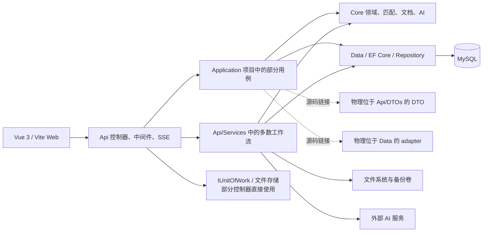
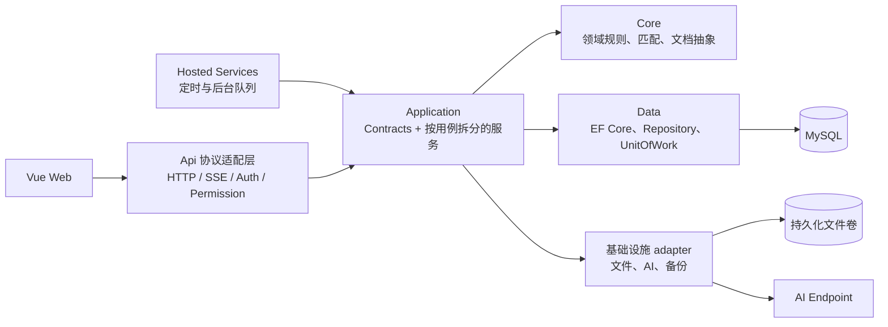

# 项目深度审核与优化建议（2026-07-10）

> 审核基线：`feat/smart-recognition-simplification` 分支，提交 `844b782`（`docs: 记录P2-D实施结果`）
>
> 审核范围：后端、前端、测试、OpenSpec、CI、部署配置、仓库资产与 Git 历史
>
> 报告性质：当前全仓快照审计。本文只记录有源码、配置、命令输出或 Git 历史证据支持的结论。

## 1. 执行摘要

当前项目的主功能和自动化回归基线总体稳定：后端 933 项测试通过，前端 251 项测试通过，Release 构建、类型检查、生产构建和 38 项 OpenSpec 严格校验均通过。此前智能识别专项报告中的 P0、#4 和 P2-D 已有实施与验证记录，本次没有证据要求重新打开。

但当前分支仍不适合直接合并或发布，原因不是主算法回归，而是发现了新的全仓问题：

1. **1 项 P0 合并阻断项**：Git 已跟踪完整的 Edge 用户配置目录，包含 Cookie、登录数据、历史记录和本地存储等凭据性文件。
2. **6 项 P1 发布前问题**：真实业务样本治理、下拉范围分页漏项、删除错误被吞、架构规格与代码不一致、文档解析错误静默降级、生产 Swagger 文档与实际行为冲突。
3. **12 项 P2 近期维护项**：lint 门禁、大型文件、资源生命周期、文件一致性、后台任务托管、内存与取消、认证存储、包体、测试有效性、覆盖率与 MySQL、构建可复现性、开发凭据治理。
4. **4 项 P3 治理项**：规格/架构文档漂移、部署卷文档遗漏、重复二进制产物、已完成 OpenSpec 变更未归档。

| 优先级 | 数量 | 处理要求                                                         |
| ------ | ---: | ---------------------------------------------------------------- |
| P0     |    1 | 合并前必须处理，并检查历史与会话失效范围                         |
| P1     |    6 | 发布前处理；架构项至少要消除“规格声明已完成、代码尚未完成”的冲突 |
| P2     |   12 | 近期分批处理，优先纳入 CI 和资源治理                             |
| P3     |    4 | 随文档、发布和仓库治理批次处理                                   |
| 合计   |   23 | 不包含已反驳候选、已修复专项问题和未验证外部风险                 |

## 2. 审核范围与方法

### 2.1 仓库规模

| 区域           |                                          当前规模 |
| -------------- | ------------------------------------------------: |
| 后端生产代码   |                                 407 个 `.cs` 文件 |
| 后端测试代码   |                                 156 个 `.cs` 文件 |
| 前端生产代码   |                        272 个 `.ts` / `.vue` 文件 |
| 前端 Node 测试 |                             39 个 `.test.ts` 文件 |
| 解决方案项目   |                        4 个生产项目、3 个测试项目 |
| OpenSpec       | 7 个正式规格域、31 个仍处于活动区的 Complete 变更 |

### 2.2 检查方法

- 读取项目规则、OpenSpec 架构规格、项目说明、解决方案和各项目引用关系。
- 按控制器、Application 服务、Core 算法、Data 持久化、文件存储、后台任务和前端页面链路检查调用边界。
- 检查分页、异常处理、取消令牌、文件生命周期、并发状态、认证存储和大文件处理。
- 检查测试构成、跳过条件、CI 步骤、lint 配置、构建预算和依赖版本策略。
- 使用 `git ls-files`、`git log`、`git merge-base`、文件哈希和目录统计检查已跟踪资产及来源提交。
- 对疑似问题做反证检查，避免把已有全局认证、路径校验、所有权校验、受控异步流程误报为缺陷。

### 2.3 已执行验证

| 验证命令                                                                                      | 结果                                    |
| --------------------------------------------------------------------------------------------- | --------------------------------------- |
| `dotnet test AcceptanceSpecSystem.sln -c Debug --no-restore`                                  | 933 通过，29 条件跳过，0 失败           |
| `dotnet build AcceptanceSpecSystem.sln -c Release --no-restore -p:TreatWarningsAsErrors=true` | 0 警告，0 错误                          |
| `pnpm --dir web test`                                                                         | Vitest 40/40；Node tests 211/211        |
| `pnpm --dir web typecheck`                                                                    | 通过                                    |
| `pnpm --dir web build`                                                                        | 通过                                    |
| `openspec validate --all --strict --no-interactive`                                           | 38/38 通过                              |
| ESLint 只读检查                                                                               | 113 个错误，均落在 Prettier 类规则      |
| Prettier 只读检查                                                                             | 35 个文件存在格式漂移                   |
| Stylelint 只读检查                                                                            | 25 个错误，包含 Vue `v-bind()` 解析误判 |

后端 29 个跳过项主要是：真实 MySQL 迁移、真实外部 AI、真实样本文档，以及 SQLite/InMemory 无法覆盖的事务或 `ExecuteDelete` 行为。前端生产构建成功，但最大 JS 块约 1.33 MB（gzip 约 442 KB），第二大 JS 块约 418 KB（gzip 约 181 KB），最大 CSS 约 431 KB（gzip 约 66.6 KB）。

## 3. 当前能力与架构

### 3.1 各部分当前能力范围

| 部分                                     | 当前实际承担范围                                                                                     |
| ---------------------------------------- | ---------------------------------------------------------------------------------------------------- |
| `web`                                    | 登录与 RBAC、基础数据、文档上传/导入、智能结构识别、智能填充、批量回复、文件对比、执行历史和系统配置 |
| `AcceptanceSpecSystem.Api` 控制器/中间件 | HTTP、SSE、鉴权、权限、请求响应适配；部分控制器仍直接编排 `IUnitOfWork` 和文件存储                   |
| `AcceptanceSpecSystem.Api/Services`      | 当前多数跨资源工作流：文档导入、匹配、填充、批量回复、文件访问、执行历史、RBAC 等                    |
| `AcceptanceSpecSystem.Application`       | 基础数据、规格、智能结构配置等一部分用例；同时通过源码链接承载来自 Api/Data 目录的 DTO 和 adapter    |
| `AcceptanceSpecSystem.Core`              | 文档解析/写入、匹配算法、Embedding/LLM 接口与实现、领域模型和规则                                    |
| `AcceptanceSpecSystem.Data`              | EF Core、MySQL、Repository、UnitOfWork、迁移和查询持久化                                             |
| 外部资源                                 | MySQL、文件卷、DataProtection key、数据库备份卷，以及可配置的 Ollama/OpenAI 兼容 AI 服务             |
| 测试                                     | Core 单元测试、Data 测试、API 集成测试、少量前端组件/逻辑测试和大量源码结构守卫                      |

### 3.2 当前真实依赖图

这张图解释了当前最重要的架构事实：项目引用方向表面上已经是 `Api -> Application -> Core / Data`，但物理代码归属、控制器依赖和主要工作流尚未全部迁移到该边界。

### 3.3 建议目标图

目标边界应满足：

- 控制器只做协议适配，不直接使用 `IUnitOfWork`、`AppDbContext` 或编排文件/数据库一致性。
- DTO/Contract 的物理位置与编译归属一致，不再通过 `Compile Include` 跨项目链接源码。
- 跨资源工作流集中在 Application，用例按职责拆分；后台工作通过宿主管理的队列或 `BackgroundService` 执行。
- Core 保持领域算法与文档能力，Data 和基础设施处理外部副作用。

## 4. P0：合并阻断项

### P0-01 Git 已跟踪完整浏览器用户配置

**结论**：真实存在，必须在合并前处理。仅新增 `.gitignore` 不足以消除已跟踪文件和历史对象。

**实施状态（2026-07-10）**：`output/` 已从当前树解除 Git 跟踪并由根目录忽略规则覆盖；旧提交中的历史对象尚未清理，远端范围确认、会话失效和必要时的历史重写仍需单独处理。

**证据**：

- `git ls-files output` 返回 788 个已跟踪文件，其中 722 个属于 Edge profile 路径。
- 路径包含 `History`、`Login Data`、`Network/Cookies`、`Preferences`、`Local Storage` 和 `Session Storage` 等浏览器状态文件。
- 来源提交为 `8d56e14 feat: 完成前端UI优化改造P1/P2级全部任务`。
- `.gitignore:126` 已有 `output/`，但 Git ignore 不会自动移除已经进入索引的文件。
- 基于当前本地 `origin/main` 引用，`git merge-base --is-ancestor 8d56e14 origin/main` 返回 1，说明该提交尚未进入本地所知的远端 main；本次未执行 `git fetch`，不能据此断言所有远端均安全。

**影响**：

- 浏览器 profile 天然包含凭据、会话、访问历史和本地业务状态，即使没有读取其内容，也应按高敏感资产处理。
- 只在后续提交删除目录，历史提交仍保留这些对象；若分支已推送，远端分支、PR 引用或缓存仍可能可访问。

**建议**：

1. 立即从当前索引移除整个 `output/`，并确保 E2E 始终创建一次性临时 profile。
2. 检查该提交是否存在于其他本地/远端分支；如需获取最新远端状态，应在明确允许联网后执行 fetch。
3. 如该 profile 使用过真实登录状态，失效相关 Cookie、refresh token 和会话。
4. 若已推送或确认包含真实会话，按影响范围重写对应分支历史；历史重写属于破坏性操作，必须单独确认。
5. 不要在排查记录或报告中输出 Cookie、登录数据库或 Local Storage 的具体内容。

**验收**：

- `git ls-files output` 无输出。
- 新建浏览器测试后，`git status --short` 不再出现 profile 文件。
- 若执行历史清理，目标分支的 `git log --all -- output` 和对象清单不再包含 profile 路径。
- 完成会话失效记录和远端范围确认。

## 5. P1：发布前问题

### P1-01 真实业务样本直接进入仓库

**实施状态（2026-07-10）**：3 个真实业务样本已从当前树解除 Git 跟踪并由根目录忽略规则覆盖，工具默认输入已替换为公开的合成夹具；旧提交中的样本历史尚未清理。

**证据**：

- 已跟踪 `huaian_specs.json`、`huaian_specs_500.json` 和 `淮安庆鼎_智能填充测试说明.md`。
- 两个 JSON 响应分别包含 200 和 500 条数据，说明文件明确描述客户/厂区语境和测试用途。
- 三个文件来源提交为 `42a51e2 chore: 提交剩余本地资料和工具`。

**影响**：是否构成泄露取决于数据授权，不能仅凭文件名断言；但在授权、保留期限和可共享范围不明确时，仓库复制会扩大数据传播面，历史提交也不会因后续删除而消失。

**建议**：

- 先确认数据所有者、授权范围、保留期限和仓库可见性。
- 私有真实样本移至受控制品库或本地忽略目录；仓库仅保留脱敏、缩小且可公开的合成夹具。
- 若没有进入 Git 的授权，评估与 P0 一并清理分支历史。

**验收**：仓库夹具具备数据来源说明和脱敏证明；未授权样本在当前树和需清理的历史中均不存在。

### P1-02 范围选项只读取第一页，数据超过上限后静默漏选

**实施状态（2026-07-10）**：已完成。智能填充、匹配配置和数据导入三个入口已接入共享全分页加载器，支持取消、按主键去重、稳定顺序和页数保护；251 条跨页场景的 API、页面和工具回归已通过。

**证据链**：

- `web/src/views/smart-fill/index.vue:190-192` 将客户、制程、机型都按第一页请求，并传入 `pageSize: 1000`。
- `web/src/views/smart-fill/components/MatchConfig.vue:169` 和 `web/src/views/data-import/composables/useDataImportTarget.ts:59` 的客户请求只取 100 条。
- 同两处的制程/机型请求传入 1000：`MatchConfig.vue:184,199`、`useDataImportTarget.ts:73,87`。
- 后端在 `CustomerAppService.cs:36`、`ProcessAppService.cs:36`、`MachineModelAppService.cs:36` 统一执行 `Math.Clamp(pageSize, 1, 200)`。

**影响**：

- 部分页面第 101 个后的客户不可选。
- 第 201 个后的客户、制程或机型在所有上述单页加载场景不可选。
- 后端不会返回错误，而是静默截断到 200，因此用户看不到“数据未加载完整”的信号。

**建议**：

1. 短期提供共享的“按 `total/pageSize` 遍历全部分页”helper，替换页面各自写死的第一页请求。
2. 中期增加轻量 options/远程搜索接口，避免主数据增长后一次性下载全部选项。
3. 统一客户、制程、机型的 option 契约和分页策略。

**验收**：创建至少 250 个客户、制程、机型，智能填充、匹配配置和数据导入都能搜索并选择最后一项；补 API 与前端契约回归测试。

### P1-03 删除/恢复操作把真实接口错误当成用户取消

**实施状态（2026-07-10）**：已完成。已确认的删除、恢复和重置路径统一只忽略 Element Plus 主动取消；其他请求错误通过共享错误消息 helper 展示，不再误报为用户取消。

**证据**：确认框和实际 API 请求位于同一 `try`，无条件 `catch` 忽略全部异常。已确认位置包括：

- `web/src/views/base-data/customers/index.vue:133,166`
- `web/src/views/base-data/processes/index.vue:120,146`
- `web/src/views/base-data/machine-models/index.vue:120,146`
- `web/src/views/base-data/specs/components/SpecTable.vue:279,312`
- `web/src/views/config/system-users/index.vue:366`
- `web/src/views/config/smart-structure-routing-rules/index.vue:322`
- `web/src/views/config/prompt-templates/index.vue:210`
- `web/src/views/config/auth-roles/index.vue:492`
- `web/src/views/config/column-mapping-rules/index.vue:318`
- `web/src/views/config/ai-services/index.vue:222`

**影响**：网络错误、超时、401/403、后端 5xx 和响应解析错误均没有提示。用户可能误以为取消了操作，或在状态不确定时重复删除。

**建议**：只忽略 Element Plus 明确返回的 `"cancel"` / `"close"`；其他异常统一通过现有 `getRequestErrorMessage` 或同等 helper 展示。可以抽取共享 `confirmAndRun`，但不要为单一页面增加复杂抽象。

**验收**：每类操作至少覆盖“主动取消、403、500、网络断开”四种路径；取消不报错，其余路径显示真实错误且不显示成功状态。

### P1-04 架构权威规格与物理代码边界不一致

**权威要求**：

- `openspec/specs/architecture/spec.md:7` 固定依赖方向为 `Api -> Application -> Core / Data`。
- `spec.md:17-22` 要求跨资源工作流位于 Application。
- `spec.md:29-40` 禁止控制器、中间件和协议适配层直接编排持久化。

**当前证据**：

- `AuthController.cs:21`、`ColumnMappingRulesController.cs:20`、`AuditLogsController.cs:17`、`AiServicesController.cs:30`、`FileCompareController.cs:23`、`PromptTemplatesController.cs:20`、`SmartStructureRoutingRulesController.cs:21` 和 `AuditOperationAttribute.cs:43` 仍直接依赖 `IUnitOfWork`。
- 文档导入、匹配、批量回复、文件访问、执行历史和部分 RBAC 用例仍主要位于 `AcceptanceSpecSystem.Api/Services`。
- `AcceptanceSpecSystem.Application.csproj:19-24` 把物理位于 Data/Api 的 adapter 和 DTO 通过 `Compile Include ... Link` 编译进 Application；Api/Data 再以 `Compile Remove` 排除原文件。
- `ArchitectureBoundaryTests.cs:22-30` 主要检查项目引用文本；`:103-119` 只检查选定的基础数据控制器，无法发现上述全部控制器和跨项目源码链接。

**影响**：

- 项目引用图看似满足规格，但文件所有权、命名空间和编译归属不一致，重构、IDE 导航和增量构建的认知成本高。
- OpenSpec 使用 MUST 表述，却没有由完整架构测试保证，后续容易继续产生控制器直写和 Api 服务膨胀。

**建议**：

1. 先把链接 DTO 迁到 `Application/Contracts`（或在规模确有需要时建立独立 Contracts 项目）。
2. 把 provider adapter 移到真实的 Application/Data/基础设施边界，不再跨目录链接源码。
3. 按模块迁移仍在 Api/Services 的用例，不做一次性全仓重写。
4. 架构测试扫描全部控制器/中间件依赖，并解析 `.csproj` 中的 `Compile Include/Link`，禁止以源码链接绕过边界。
5. 若短期无法完成迁移，必须把规格明确标记为“过渡目标 + 已完成范围”，不能继续声明全部完成。

**验收**：Application 项目不再编译 Api/Data 目录源码；控制器不直接依赖 `IUnitOfWork`/`AppDbContext`；核心跨资源流程均由 Application 用例服务编排；架构测试能对故意加入的违规依赖稳定失败。

### P1-05 文档解析异常被静默转换为“空数据”

**实施状态（2026-07-10）**：已完成。解析器不可用、目标表不存在和合法空结果仍返回空集合；损坏文件、I/O 和未知解析异常改为固定 400 业务错误，并记录不含文档内容的文件 ID、文件类型、表索引和异常类型结构化日志。

**证据**：`src/AcceptanceSpecSystem.Api/Services/DocumentTableAccessService.cs:219-224` 对解析调用使用无类型 `catch` 并直接 `return []`。

**影响**：损坏文件、I/O 故障、解析器缺陷和暂时性资源异常都会被表示成“没有匹配数据”。上层无法区分合法空表与解析失败，可能给用户错误结论或触发错误的后续处理。

**建议**：

- 只对明确允许降级的异常返回空集合，并记录结构化原因。
- 对文件损坏、I/O 和未知异常返回可诊断的业务错误；日志包含文件 ID、表索引和异常类型，不记录敏感文档内容。
- 用明确结果类型表达 `Empty`、`Unsupported`、`InvalidDocument`、`Failed`，或沿用项目现有异常映射机制。

**验收**：合法空表仍返回空结果；损坏文档、锁定文件和解析器异常能被 API/前端区分并展示可操作信息。

### P1-06 生产 Swagger 部署文档与运行时配置冲突

**实施状态（2026-07-10）**：已完成。Production 继续关闭 Swagger，Docker、Windows Docker 和 IIS 部署文档统一以 health 端点验收；自动化守卫同时覆盖文档入口和 `Program.cs` 的开发环境 Swagger 条件块。

**证据**：

- `Program.cs:285-293` 仅在 `Development` 环境启用 Swagger。
- `docker-compose.yml:35` 将 API 环境设为 `Production`。
- `docs/DEPLOY-DOCKER.md:41` 声称生产可访问 `/swagger`。
- `docs/DEPLOY-IIS.md:17,124` 同样将生产 Swagger 作为部署验证入口。

**影响**：运维按文档部署后会得到 404，并可能误判 API 未启动；IIS/Docker 的验收流程不可靠。

**建议**：二选一并写入统一决策：

- 内网确需生产 Swagger：增加显式配置开关，并限制到授权用户或受控网络边界。
- 生产不开放 Swagger：删除部署文档中的 Swagger 验收步骤，改用 `/health` 或实际健康检查端点。

**验收**：Production 环境实际行为与 Docker/IIS 两份文档一致，并有自动化部署烟测验证选定端点。

### 批次 1 验证记录

- 前端测试通过：Vitest 55 项、Node 226 项；类型检查通过。
- Production 部署文档守卫通过 2 项；Release warnings-as-errors 构建为 0 警告、0 错误。
- 后端 Release 全量测试通过：Core 330 项、Data 78 项通过/11 项跳过、API 535 项通过/18 项跳过。API 集成测试程序集已禁用集合并行，避免隔离资源在成组运行时互相干扰。

## 6. P2：近期维护与可靠性

### P2-01 前端没有只读 lint 门禁，当前基线不能通过

**证据**：

- `.github/workflows/ci.yml:57-64` 只执行 typecheck、test、build。
- `web/package.json:20-23` 的 lint 脚本都带 `--fix` 或 `--write`，不适合作为 CI 只读门禁。
- 当前只读检查结果为 ESLint 113 个错误、Prettier 35 个文件漂移、Stylelint 25 个错误。
- `web/stylelint.config.js` 对 Vue/CSS 的 override 和规则组合还会误判部分 `v-bind()`，不能直接把当前结果全部当成业务代码错误。

**建议**：先修正 Stylelint Vue 语法配置并清零现有格式基线，再增加 `lint:check`、`format:check`、`stylelint:check`，最后接入 CI。自动修复脚本保留给本地显式调用。

**验收**：全新检出后，CI 只读 lint 通过且不修改工作树；故意制造格式错误会使 CI 失败。

### P2-02 多个巨型文件已形成职责和评审热点

**当前热点**：

| 文件                                     |  行数 | 主要问题                                                   |
| ---------------------------------------- | ----: | ---------------------------------------------------------- |
| `AiServicesController.cs`                | 1,144 | CRUD、连接测试、模型探测、HTTP/JSON 分类、持久化混在控制器 |
| `SmartConfigurationAppService.cs`        | 1,256 | 识别、召回、融合、缓存、规则和预算集中                     |
| `MatchingDtos.cs`                        | 1,547 | 38 个公开类型集中在单文件                                  |
| `useDataImportPage.ts`                   | 1,179 | 页面状态、请求、校验和流程编排集中                         |
| `EvidenceDrivenSemanticMatchingTests.cs` | 3,544 | 多类场景和测试设施集中                                     |
| `smart-fill-ai-equivalence.test.ts`      | 1,545 | 大量结构断言集中                                           |

`ArchitectureBoundaryTests.cs:755-792` 的大型文件守卫只覆盖部分 Api 服务前缀和 Core Matching 服务，没有覆盖 Application、DTO、控制器和前端热点。

**建议**：优先拆职责而不是机械按行切 partial：AI 服务控制器拆查询/命令/连接探测用例，SmartConfiguration 拆识别编排与策略组件，DTO 按 API 契约域拆分，前端 composable 按状态/请求/步骤拆分。扩展守卫时允许少量有理由的基线例外，避免阈值驱动的无意义文件拆分。

**验收**：热点文件职责可独立测试；核心用例文件进入可维护阈值；守卫覆盖 Application、控制器和 DTO，并对新增巨型文件失败。

### P2-03 BatchReply 会话锁和过期清理缺少完整生命周期

**证据**：

- `BatchReplySessionService.cs:26` 使用 `ConcurrentDictionary<string, SemaphoreSlim>` 保存每个 session 的锁。
- `:301-304` 只通过 `GetOrAdd` 创建，文件内没有 `TryRemove` 或等价回收路径。
- 过期 session/artifact 清理在 `:61,213,324` 等业务请求路径触发，而不是独立后台清理任务。

**影响**：长时间运行且 session ID 持续增长时，锁字典不会回收；低流量实例可能长期保留过期 manifest 和文件，直到下一次相关请求到来。

**建议**：使用带引用计数的 keyed lock 或确认无等待者后安全移除，避免简单 `TryRemove` 导致同一 session 出现两把锁；把过期清理迁到可取消、可观察的 `BackgroundService`，业务请求可保留轻量兜底清理。

**验收**：并发 session 压测后锁数量能回落；无后续业务请求时过期文件仍会在目标窗口内清除；宿主停止时清理任务正常取消。

### P2-04 文件原子写入和数据库/文件系统一致性缺少补偿

**证据**：

- `FileStorageService.cs:130-141` 先写临时文件再 Move，但没有 `finally` 清理；写入后 Move 失败会遗留 `.tmp`。
- `DocumentFileAppService.cs:123-143` 先把文件落盘，再新增 `WordFile` 并保存数据库；数据库写入失败时没有删除已落盘文件。

**影响**：磁盘故障、权限变化、数据库瞬时失败或取消可能产生临时文件和无数据库引用的孤儿文件，长期运行后占用卷空间并增加排障难度。

**建议**：临时路径使用 `try/finally` 清理；文件成功、数据库失败时执行幂等补偿删除并记录失败；增加周期性孤儿文件审计，不建议把数据库和文件系统伪装成单一事务。

**验收**：注入 Move 失败、数据库保存失败和取消场景，临时文件/孤儿文件均被清理；补偿失败有可监控日志。

### P2-05 导入后 Embedding 预热脱离宿主管理

**证据**：`DocumentImportAppService.Execution.cs:228-244` 使用 `_ = Task.Run(...)` 和 `CancellationToken.None` 启动预热。

**边界判断**：当前 manager 为 singleton，未发现捕获 scoped 服务的生命周期错误；异常也有日志。因此这不是立即的失控任务缺陷，但任务不受宿主停机、背压和统一可观测性管理。

**建议**：通过有界 Channel/队列提交预热请求，由 `BackgroundService` 合并重复触发、响应停机取消并暴露运行状态。导入请求只负责投递，不直接创建后台线程任务。

**验收**：连续导入不会并发启动无上限预热；停止应用时任务可取消；失败、重试和最后成功时间可观察。

### P2-06 大文件下载与文档处理的内存/取消边界不完整

**证据**：

- `MatchingTaskAppService.cs:65` 使用 `File.ReadAllBytesAsync(fullPath)`，未传入取消令牌，并把整个结果文件装入内存。
- Word/Excel parser/writer 多处以 `Task.Run` 包装同步库，例如 `WordDocumentParser.cs:72,126`、`WordDocumentWriter.cs:58,74`、`ExcelDocumentWriter.cs:28,37`。
- `IDocumentParser` 的核心提取接口没有一致贯穿 `CancellationToken`，取消请求不能停止底层文档处理。

**影响**：大文件或并发下载提高内存峰值；同步文档库在高并发下占用线程池；客户端取消后服务器仍可能继续做昂贵处理。

**建议**：下载优先流式响应并传递 `RequestAborted`；文档接口贯穿取消令牌，在同步库不可中断的位置至少做阶段间取消检查和并发限流；对上传/解析/生成设置可配置大小与并发预算。

**验收**：大文件并发测试中内存峰值受控；断开请求后可观察任务及时收口；线程池无持续饥饿。

### P2-07 Token 存储策略适合当前内网，但缺少暴露面升级方案和并发回归测试

**证据**：

- `web/src/utils/auth.ts:83-98` 把 access/refresh token 写入可由 JavaScript 读取的 Cookie。
- `auth.ts:84,109-151` 同时把用户和 refresh token 信息写入 localStorage。
- `web/src/utils/http/index.ts:88-170` 已实现单次刷新和等待队列，但前端测试中没有覆盖并发过期、刷新失败和队列拒绝。

**边界判断**：按当前内网部署约束，这不是 P0/P1；若系统开放到更大网络或承载更敏感数据，可读 token 会放大 XSS 后果。

**建议**：当前先补并发刷新测试和明确威胁模型；若暴露面升级，迁移到服务端设置的 `HttpOnly`、`Secure`、明确 `SameSite` 的 Cookie，并同步处理 CSRF。不要只改变存储位置而忽略后端认证模型。

**验收**：10 个并发过期请求只触发一次 refresh；成功后全部重放，失败后全部拒绝并只跳转一次；部署安全说明明确当前边界。

### P2-08 前端包体预算被放宽，全量 Element Plus 注册抵消按需优化

**证据**：

- `web/vite.config.ts:90` 把 `chunkSizeWarningLimit` 提高到 4000 KB，实际失去常规预警作用。
- `web/src/plugins/elementPlus.ts:3-226` 导入并注册几乎全部 Element Plus 组件。
- `web/src/main.ts:21` 全量引入 `element-plus/dist/index.css`。
- 本次构建最大 JS 块约 1.33 MB，最大 CSS 约 431 KB。

**建议**：先记录现有 gzip/raw 基线和首屏性能，再设置合理回归预算；按真实使用清单减少全局组件，或使用成熟的自动按需导入；对智能填充、数据导入和配置页面做路由级懒加载。不要仅降低 warning 阈值而不验证用户侧收益。

**验收**：CI 输出 chunk 清单并对预算回归失败；首屏主块和 CSS 明显下降；关键路由无组件样式缺失。

### P2-09 前端测试大量依赖源码字符串，缺少真实浏览器流程

**证据**：

- `web/tests` 的 39 个 Node 测试中，31 个会读取源码并做正则或字符串断言。
- Vitest 只有 5 个测试文件、40 项测试。
- 仓库没有 Playwright/Cypress 浏览器配置；现有 `.NET E2EFillFlowTests` 不是浏览器端到端测试。

**影响**：结构守卫能防止某段文本被删除，但不能证明组件渲染、交互、路由、下载和错误反馈真实可用；重构等价代码时也容易产生高维护成本的误报。

**建议**：保留少量高价值结构守卫，为登录、范围选择、上传、导入、智能填充、下载各补一条稳定浏览器主流程；组件逻辑优先用 Vitest + Vue Test Utils 验证行为，不读取实现源码。

**验收**：CI 至少运行一组无外部 AI 依赖的浏览器烟测；删除关键交互或错误提示会使行为测试失败。

### P2-10 覆盖率和真实 MySQL 差异没有进入常规 CI

**证据**：

- 三个测试项目都引用 `coverlet.collector`，但 CI 未采集或发布覆盖率。
- `MySqlSmokeFactAttribute.cs:8-19` 在未设置环境变量时跳过真实 MySQL 迁移烟测。
- 常规测试使用 SQLite/InMemory，不能覆盖 MySQL 排序规则、SQL 翻译、迁移和特定事务行为。

**建议**：先采集覆盖率作为趋势数据，不立即设置武断阈值；PR 或 nightly CI 启动 MySQL service container，至少执行迁移、启动和关键查询烟测。真实 AI 测试继续保持显式 opt-in。

**验收**：CI 可查看 Core/Application/API 覆盖率趋势；MySQL 迁移从空库到最新版本通过；至少一条生产查询在 MySQL 上执行。

### P2-11 构建和依赖基线不完全可复现

**证据**：

- `Directory.Build.props:7` 注释称警告作为错误，`:8` 实际为 `false`；CI 未显式传入 `TreatWarningsAsErrors=true`。
- `AcceptanceSpecSystem.Data.csproj:14` 使用 `8.0.*`，`Directory.Build.props:19` 使用 `9.0.*` 浮动 NuGet 版本。
- CI 使用 Node 22（`.github/workflows/ci.yml:50`），Docker 使用 Node 20（`web/Dockerfile:3`）。
- Core 仍显式引用 `System.Net.Http 4.3.4`、`System.Text.RegularExpressions 4.3.1` 等旧 BCL 包，是否仍必要尚未形成说明。

**建议**：启用或在 CI 强制 warnings-as-errors；固定 NuGet 版本并由依赖更新工具显式升级；统一 `.nvmrc`/Volta/Corepack、CI 和 Docker Node 主版本；审查 net8 下冗余 BCL 引用。

**验收**：本地、CI、Docker 使用同一 Node/pnpm 基线；两次干净 restore 得到一致版本；警告会阻断 CI。

### P2-12 开发和示例配置包含可直接复用的固定口令

**实施状态（2026-07-10）**：配置治理已完成。示例敏感值已置空，开发连接串已从 `launchSettings.json` 移除，开发与 Docker 部署文档已改为本地配置和强制填写敏感值的流程，并由自动化守卫覆盖。

**证据**：

- `.env.docker.example:6-12` 给出固定数据库和 JWT 示例值，数据库名仍带旧功能分支语义。
- `Properties/launchSettings.json:20` 跟踪固定开发数据库口令；本机的 `appsettings.Development.json` 已被 `.gitignore:83` 忽略，不属于 Git 暴露范围。
- 生产配置已有空值和启动校验，本项不表示生产默认会静默使用这些开发口令。

**影响**：内网开发中风险有限，但示例值容易被直接复制到共享测试或长期环境；如果同一口令被复用，仓库历史会扩大暴露面。

**建议**：数据库名改为稳定产品语义；固定开发口令迁到 User Secrets 或本地环境变量；示例文件使用明显不可直接部署的占位符，并在启动脚本中生成随机值或强制覆盖。若现有值被共享环境复用，应轮换。

**验收**：全新开发环境有清晰初始化步骤；仓库不含真实共享环境凭据；生产和共享测试环境不能以示例值启动。

## 7. P3：文档与仓库治理

### P3-01 项目说明、架构图和分支文档存在漂移

**证据**：

- `openspec/project.md:54` 仍写旧依赖 `Api -> Core -> Data`，与正式架构规格冲突。
- `openspec/project.md:76` 只要求前端 build，没有反映当前 test/typecheck 和未来 lint 门禁。
- `docs/architecture-diagrams.md:36-45` 正确说明 Application 尚不完整；但 `latest-architecture-map-2026-07-09.html:642` 的“已经收敛到用例服务编排”容易被理解为全部完成。
- `docs/README.md:118` 仍称核心文档使用 `develop` 分支，而 `openspec/project.md:79` 声明主分支为 `main`。
- `.github/workflows/ci.yml:7,11` 仍保留旧功能分支 `feat/add-ai-equivalence-adjudication` 触发器。

**建议**：明确一个权威架构状态页；架构图同时标注“已完成”和“过渡中”；更新项目测试策略和分支说明；删除已无用途的固定功能分支触发器。

**验收**：OpenSpec project、正式 architecture spec、架构图、README 和 CI 对分支/层次/门禁描述一致。

### P3-02 Docker 部署文档遗漏数据库备份卷

**证据**：`docker-compose.yml:40,56,75` 已配置 `/app/backups` 和 `api-backups`；`docs/DEPLOY-DOCKER.md:54-60` 的持久化卷清单只列 `mysql-data`、`api-files`、`api-dpkeys`。

**影响**：备份恢复、容量规划和 `docker compose down -v` 风险说明不完整，运维可能误删唯一备份副本。

**建议与验收**：补充 `api-backups` 的用途、保留策略、离机备份和恢复演练；文档明确 `down -v` 同样删除本机备份卷，并完成一次恢复烟测。

### P3-03 仓库存在重复生成文件，测试夹具边界不清晰

**证据**：

- `docs/filled_1b71738923924bfc8d14931e85229481.docx`、`filled_94318e950ef24eb88547d38dcc21ab44.docx`、`filled_b8054c055e574194ba14a93ec1a0c808.docx` 的 SHA256 完全相同。
- 每个文件约 2.37 MB，三份共约 7.1 MB。
- `docs/example.docx` 被测试使用，但放在文档目录，产物与 fixture 的所有权不清晰。

**建议**：重复生成结果移出 Git 或只保留一个有说明的样例；测试依赖迁到明确的 `tests/.../Fixtures` 并由测试项目复制。删除二进制文件属于不可逆仓库操作，应在单独确认后执行。

**验收**：文档目录不再堆积运行产物；fixture 有唯一所有者、用途说明和大小预算。

### P3-04 31 个 Complete OpenSpec 变更仍未归档

**证据**：`openspec list` 显示 31 个活动变更均为 `Complete`，最早项已长期完成。

**边界判断**：如果变更尚未部署或验收，保留活动状态是合理的；如果已经发布，持续不归档会降低活动变更列表的信噪比。

**建议**：按“已实现 + 已验证 + 已部署/验收”三条件批量确认，满足条件后用 OpenSpec 正式归档流程处理；未部署项补充状态说明，不按日期盲目归档。

**验收**：活动列表只保留真正进行中或待部署变更；归档后 `openspec validate --all --strict --no-interactive` 继续通过。

## 8. 已排除候选与当前有效防线

以下事项经过反证检查，不应在本轮作为缺陷重复处理：

1. `SemanticKernelMatchingService.Llm.cs` 的 `.Result` 是数据对象属性，不是 `Task.Result`，没有同步等待问题。
2. `LlmMatchingAssistService.Generation.cs` 的 `Task.Run` 通过 Channel completion 把结果和异常重新汇入调用链，不是失控 fire-and-forget。
3. 文档下载已有任务用户/公司归属校验，没有发现可直接跨用户下载的路径。
4. 文件路径通过 `GetFullPath` 并校验存储根目录，没有发现可利用的路径穿越。
5. 全局认证使用 FallbackPolicy；缺少显式 `[Authorize]` 的控制器并不自动匿名。
6. 权限中间件对未知端点默认拒绝，没有发现未知权限默认放行。
7. 智能填充页面在 `web/src/views/smart-fill/index.vue:371-375` 已于卸载时停止预览和 LLM 流，不再存在此前候选的 20 分钟离页残留问题。
8. 启动时自动数据库迁移是当前 OpenSpec 的明确要求，不能只按通用部署偏好判为错误。
9. 上一份智能识别专项报告中的 null 契约、仅规格门禁、G5 元数据防御、#4 预算、P2-A/B/C/D 已有修复和回归记录，本次全仓审计没有发现证据要求重新打开。

## 9. 建议实施路线

### 阶段 0：合并前

1. 处理 P0 浏览器 profile：索引、远端范围、历史和会话四项一起闭环。
2. 确认真实业务样本授权；无授权则与 P0 一并制定历史清理方案。
3. 修复 P1-02 分页漏项、P1-03 错误吞噬、P1-05 解析静默失败。
4. 对 P1-04 做明确决策：完成当前声明范围，或把规格改成真实的过渡状态并建立迁移清单。
5. 统一生产 Swagger 行为与部署文档。

### 阶段 1：下一维护批次

1. 清零前端 lint 基线，增加只读 CI 门禁。
2. 修复文件临时文件/数据库补偿，托管 Embedding 预热，治理 BatchReply 锁和定时清理。
3. 增加 >200 条 option 契约测试、token 并发刷新测试和关键浏览器流程。
4. 把真实 MySQL 迁移烟测纳入 PR 或 nightly CI。

### 阶段 2：按模块演进

1. 先迁移 DTO 和 adapter 的物理归属，再按模块迁移 Api/Services 用例，避免大爆炸式重写。
2. 拆分 AI 服务控制器、SmartConfiguration、Matching DTO 和数据导入 composable 等热点。
3. 建立包体、覆盖率、文件大小和依赖版本的趋势门禁。
4. 同步清理文档漂移、重复产物并归档已发布 OpenSpec 变更。

## 10. 最终验收清单

- [ ] `git ls-files output` 无输出，远端和历史范围已确认，必要会话已失效。
- [ ] 真实业务样本有授权/脱敏记录，或已从当前树及必要历史移除。
- [ ] 超过 200 条基础数据时，所有目标选择器都能搜索完整数据。
- [ ] 删除/恢复请求的取消与失败可正确区分。
- [ ] 损坏文档不会被报告为合法空表。
- [ ] 架构规格、物理代码和架构测试一致，不再以源码链接伪装层边界。
- [ ] Production 的 Swagger/health 行为与 Docker、IIS 文档一致。
- [ ] 前端只读 lint、类型检查、测试和构建全部进入 CI。
- [ ] 文件补偿、后台预热、会话清理具备取消、监控和故障测试。
- [ ] 至少一组浏览器主流程和一组真实 MySQL 烟测进入自动化。
- [ ] Node/NuGet 版本、警告策略、包体和覆盖率均有可重复基线。
- [ ] OpenSpec 严格校验、后端测试和前端测试继续全部通过。

## 11. 审核限制

本报告没有读取或展示浏览器 Cookie、登录数据库和真实业务样本的具体字段内容；没有执行 `git fetch`，因此远端判断只基于当前本地 remote refs；没有调用真实外部 AI、真实生产数据库或真实客户文件；没有执行联网依赖漏洞/过期扫描；没有进行生产负载、长时间稳定性和真实浏览器端到端测试。

因此，以下内容仍需在获得相应环境和授权后单独验证：最新远端历史范围、依赖漏洞、MySQL 生产差异、真实 AI 质量/超时、真实大文件资源曲线、生产反向代理和浏览器完整业务流程。
